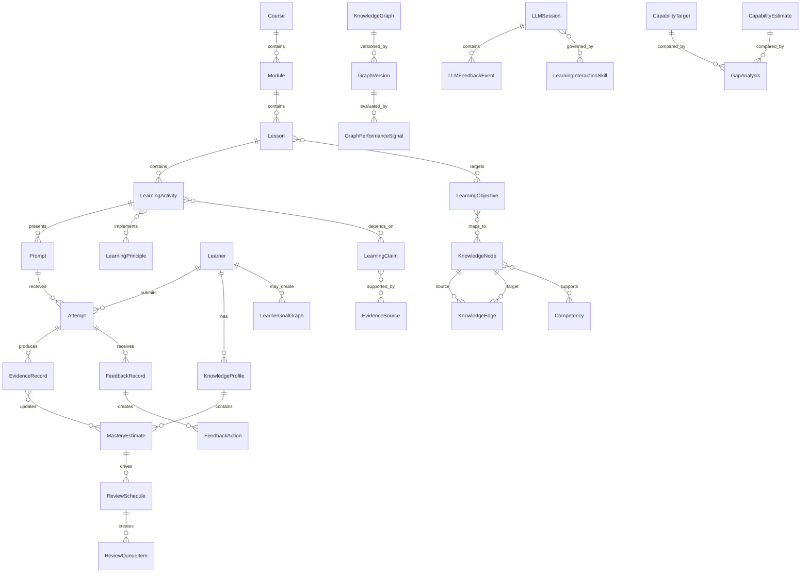

# Learning Management System Project Plan

Status: initial full design structure.

This plan translates the collected research into an implementation-facing design for the LMS repo. It is grounded in:

- [Learning principles and LMS design register](../research/learning-principles.md)
- [Research-to-product domain model](research-domain-model.md)
- [Comparative synthesis: The Math Academy Way and How Do We Learn?](../research/math-academy-way/synthesis-with-how-do-we-learn.md)

The goal is to define the system shape before implementation begins, then identify the decisions that need the project owner's judgment.

## Design Thesis

The LMS should be a learning engine, not a content warehouse.

Its core responsibility is to help learners build durable, usable knowledge by:

- turning content into observable learner actions;
- modeling knowledge as connected objectives, prerequisites, cases, and competencies;
- treating assessment as evidence and retrieval practice, not only certification;
- scheduling spaced, interleaved, and remedial practice from learner state;
- keeping measurement humble by storing evidence type, confidence, recency, and validity scope;
- supporting coaches, managers, and authors without turning learner data into crude surveillance;
- preserving research provenance so feature choices can be audited and revised.

The system should borrow Math Academy's adaptive infrastructure ideas where they apply, while using the Ruiz Martin research notes as guardrails against overclaiming, pseudoscience, weak measurement, and harmful motivational design.

Compared with ordinary learning systems, this system should also support guided LLM interaction as a learning surface. A learner should be able to ask questions, explore related ideas, generate examples, test understanding, and personalize a session, but the interaction must remain accountable to learning principles. When the learner drifts into ineffective behavior, such as asking for answers without retrieval, repeatedly rereading instead of attempting recall, using the model to bypass productive struggle, or treating fluent explanation as mastery, the system should be able to provide formative feedback and redirect the session.

That LLM layer should be observable and evaluable. LangChain/LangGraph and LangSmith should be treated as core architecture elements: LangChain/LangGraph for orchestration of tutoring, retrieval, tool use, and session personalization; LangSmith for tracing, evaluation datasets, prompt/version comparison, and performance review of LLM learning interactions before they become high-trust product behavior.

## Product Scope

### Primary Audiences

| Audience | Core need | Product stance |
| --- | --- | --- |
| Personal learner | Convert reading, notes, and projects into durable knowledge. | Fast capture, retrieval prompts, spaced review, self-calibration, and personal knowledge graph. |
| New analyst | Learn investment philosophy, workflows, research standards, risk judgment, and firm-specific practices. | Structured curriculum, cases, rubrics, coaching feedback, delayed checks, and competency evidence. |
| Company-wide learner | Learn internal tools, processes, projects, policies, and operating norms. | Repeatable onboarding, role-based pathways, compliance where needed, and manager-visible progress. |
| Public learner or client | Learn public-facing educational material, product offerings, and domain concepts. | Clear explanation, guided Q&A, retrieval checks, misconception detection, and aggregate understanding feedback for the institution. |
| Course author or trainer | Turn expertise into learning objects and practice sequences. | Authoring tools that force objective, mechanism, evidence, assessment, and feedback decisions. |
| Coach, manager, or reviewer | See where help is needed and whether training is working. | Actionable learner-state summaries, not raw activity dashboards. |
| Administrator | Govern access, sensitive content, records, and tenant boundaries. | Strong role model, audit trails, retention policy, and sensitive-content controls. |

### Initial Product Boundary

The first implementation should be API-first. A web app can follow once the data model and workflows are coherent.

The first useful backend (Phase 1 / v1 personal-research-note slice) should support:

- knowledge nodes and prerequisite relationships (with `ownership_scope`);
- learning goals (knowledge-type-tagged);
- `SourceReference` as a first-class entity with stable identity, content hash, and drift detection;
- retrieval prompts that link to one or more `SourceReference` records and carry provenance fields;
- learner attempts;
- evidence records (verbose schema; see Mastery section);
- a basic review queue with reason codes, daily cap, and pause/vacation mode;
- LLM sessions with `trace_class` and local-first privacy redaction;
- mastery as a computed view over evidence;
- a workable learner interface and Inspect surface for testing core flows;
- v1 export and dry-run import contract for backup and migration;
- source and principle links for learning-design provenance (principles/claims/sources live as YAML in `docs/research/` with a build-time validator, not as runtime DB tables).

`Course`/`Module`/`Lesson`, full curriculum authoring CRUD, `FeedbackRecord` as a separate table, and runtime research-registry APIs are explicitly deferred until institutional curriculum authoring enters scope (Milestone 5+).

It should not start with:

- a general social learning network;
- unrestricted AI tutoring;
- marketing-facing acceleration claims;
- a large polished frontend before the learning model exists;
- high-stakes manager dashboards that expose learner data before trust boundaries are defined.

## Research-Based Design Commitments

### 1. Content Completion Is Not Learning Evidence

The system may record content exposure, but mastery must come from learner performance.

Implementation consequence:

- Store `ContentExposure` separately from `LearningEvidence`.
- Do not allow course completion rules to rely only on page views, video completion, or file downloads.
- Require at least one active cognitive task for objectives that claim learning.

### 2. Learner Action Must Be Observable

Every substantial lesson should specify what the learner must do mentally and behaviorally.

Implementation consequence:

- Each learning activity should declare an `intendedCognitiveAction`, such as recall, explain, compare, classify, predict, solve, apply, revise, or reflect.
- Prompt records should capture the expected answer form and the evidence that the response can support.

### 3. Knowledge Should Be Modeled As A Graph Where The Domain Supports It

Some domains are not strictly hierarchical, but many learning paths contain real dependencies. The LMS should support graph structure without pretending every topic has math-like precision.

Implementation consequence:

- Add `KnowledgeNode` and `KnowledgeEdge`.
- Support edge types such as prerequisite, key prerequisite, encompassing, interference risk, analogy, contrast, transfer context, and supports competency.
- Store confidence in graph edges because many professional-domain relationships will be authored judgments rather than validated facts.

### 4. Mastery Is An Evidence-Backed Estimate

Mastery should not be a boolean property set by one quiz.

Mastery is also not permanent. The system should preserve evidence that a learner once mastered something, but the more important product question is what the learner currently appears to know and be able to do, how confident the system is in that judgment, and what evidence would update it.

Implementation consequence:

- Represent mastery with `MasteryEstimate`, modeled as a computed view over `EvidenceRecord` history rather than a separately-written table. Changing the update rule is then a recompute, not a migration.
- Ship v1 with a deliberately simple placeholder rule (FSRS-4.5 with default parameters), with the explicit understanding that the rule is throwaway scaffolding while data accumulates.
- Treat the `EvidenceRecord` schema as the load-bearing decision. Log enough raw signal that a learned model (BKT, IRT, Elo-style, half-life regression, or learned-FSRS parameters) can be fit later. v1 fields: timestamp, prompt id, `prompt_version_id` (links to specific `PromptVersion`), prompt demand level, knowledge type, time since last attempt, response time, correctness, confidence rating, hint use, reference use, support level, retrieval demand, transfer distance, source-match quality, `scorer_type` (`auto` / `llm-judge` / `rubric-self` / `human`), `scorer_id`, `scorer_version`, `scoring_method` (`binary` / `partial-credit` / `rubric-scored`), `raw_score`, `normalized_score`, `max_score`, `partial_credit_dimensions` (JSON for rubric-scored items), `item_difficulty_estimate` (nullable placeholder for future IRT-style fits), `attempt_context` (session id, device class, UI mode), `validity_scope` (what context this evidence is valid for, e.g. "factual recall under timed conditions"), and `answer_artifact_ref` (for answers too large to inline, e.g. a memo PDF).
- `MasteryEstimate` recompute policy: for v1 (one learner, small data volume), recompute on demand. Add an optional materialized cache once a measured latency threshold (e.g. ≥200ms p99 on Inspect or scheduler reads) OR a record count threshold (~10,000 `EvidenceRecord` rows per learner) is crossed. Cached entries store `estimator_version` and `generated_at` so a rule change invalidates stale rows automatically.
- Resolve the estimator function in code via a `MasteryEstimatorPolicy` keyed on knowledge type. Per-domain estimators are a later refinement, not a v1 schema commitment. Schema generality (uniform `EvidenceRecord` and `MasteryEstimate`) matters more than model generality (one formula for everything).
- Separate observed evidence from inferred evidence.
- Store confidence, recency, evidence type, support level, assessment validity, and downstream decision scope.
- Distinguish same-session success, delayed retention, fluency, and transfer.
- Track historical mastery separately from current mastery confidence.
- Treat recertification or reassessment as a normal learning-maintenance loop, not as a negative event.
- Plan empirical tuning around Milestone 6-7 once ~500-1000 evidence records exist on overlapping nodes. Produce a written `MasteryModelV2` proposal grounded in observed data, ship behind a feature flag in shadow mode, and switch when the learned model produces detectably better next-attempt predictions.

### 5. Retrieval, Spacing, Interleaving, And Remediation Should Be Scheduler Inputs

The scheduler should choose tasks based on learning function, not just calendar availability.

Implementation consequence:

- A review queue should support due reviews, mixed practice, remediation, and new instruction.
- Later tasks may grant implicit review credit to earlier nodes, but that credit should be marked as inferred and lower-confidence until validated.
- The scheduler should be explainable: learners and coaches need to know why a task appears.

### 6. Feedback Should Create A Next Action

Feedback should not end at a score or comment.

Implementation consequence:

- Feedback records should include target, evidence, diagnosis, gap, and next action.
- Feedback can assign revision, retry, review, prerequisite remediation, reflection, or human review.
- Trait feedback should be prohibited in product copy and authoring defaults.

### 7. Transfer Must Be Designed And Measured

Analyst and company training should not certify understanding from literal reproduction alone.

LLM interaction is especially useful for transfer work when it is constrained by the learning model. The system can ask learners to apply an idea to a new context, generate contrasting cases, probe boundary conditions, role-play a decision point, or explain why a familiar rule does not apply. Those interactions should be logged as formative learning evidence unless the task has been explicitly designed and validated as assessment evidence.

Implementation consequence:

- Objectives should declare expected future-use contexts.
- Cases and assessments should identify whether they test near transfer, far transfer, routine procedure, or judgment.
- Competency progress should require performance in varied realistic contexts where appropriate.
- LLM-generated transfer prompts should be versioned and reviewable.
- Transfer interactions should record prompt context, support level, learner response, feedback, and whether the evidence is formative or assessment-grade.

### 8. Motivation And Accountability Need Guardrails

The system can use goals, progress, effort metrics, and accountability, but these must not reward shallow compliance or shame learners.

Accountability should not be reduced to comfort. Standards, deadlines, consequences, and pressure can be useful when they are aligned with meaningful learning behavior, interpreted as task-specific feedback, and paired with a path forward. The system should let accountability be personalized: some learners may benefit from reminders and streaks, others from private goals, scheduled coach check-ins, deadlines, or clearer standards. Positive and negative feedback should be chosen according to learning purpose, learner state, and research-backed motivational effects rather than a blanket tone preference.

Implementation consequence:

- XP-like metrics should be optional and subject to anti-gaming rules.
- Learner-facing labels should describe current state or next action, not fixed ability.
- Manager views should prioritize support actions and overdue learning risks, not public ranking.
- Store accountability preferences and intervention history.
- Distinguish standards-based pressure from identity-threatening feedback.
- Evaluate motivation features for persistence, retention, transfer, shallow compliance, and learner trust.

### 9. Research Claims Must Stay Reviewable

The repo should preserve the difference between a learning principle, a product hypothesis, and a validated product result.

The research base should also be refreshed periodically. Learning-science claims, domain-specific pedagogy, dyslexia research, AI tutoring practices, and LLM evaluation methods will change over time. The product should support scheduled research scans and academic-argument reviews so authors can see when a principle, graph design, prompt pattern, or assessment method needs re-evaluation.

Implementation consequence:

- Keep `LearningPrinciple`, `LearningClaim`, `EvidenceSource`, `InstructionalIntervention`, `OutcomeMeasure`, and `Experiment`.
- Math Academy-specific product claims should remain `needs-review` until independently evaluated.
- Internal product analytics should not be presented as causal evidence unless the experiment design supports that inference.
- Add scheduled `ResearchScan` or `EvidenceReview` records for current literature checks.
- Track domain-specific evidence when building a knowledge graph for a specialized area.
- Preserve disagreement among sources instead of collapsing contested academic arguments into one product rule.

## Product Architecture

### Module Map

```text
LMS
|-- Research Registry
|-- Curriculum Authoring
|-- Knowledge Graph
|-- Graph Design Studio
|-- Learning Activity Engine
|-- LLM Learning Interaction Layer
|-- Retrieval And Assessment Engine
|-- Review Scheduler
|-- Feedback And Rubric System
|-- Learner Model
|-- Current Capability And Certification
|-- Scenario And Simulation Layer
|-- Coaching And Accountability
|-- Analytics And Reporting
|-- Governance, Security, And Audit
`-- Integrations And Importers
```

### Research Registry

Purpose:

- Preserve provenance from research notes, citations, product decisions, internal experiments, and deprecated claims.
- Prevent unsupported claims from silently becoming product behavior.

Core records:

- `LearningPrinciple`
- `EvidenceSource`
- `LearningClaim`
- `InstructionalIntervention`
- `OutcomeMeasure`
- `Experiment`
- `ProductDecision`
- `DeprecatedClaim`

Initial capabilities:

- Link course activities to principles and claims.
- Mark claim status and evidence level.
- Record review cadence.
- Block or warn on deprecated claims such as fixed learning styles.

### Curriculum Authoring

Purpose:

- Let authors define structured learning experiences that map content to objectives, activities, evidence, feedback, and review policies.

Core records:

- `Course`
- `Module`
- `Lesson`
- `LearningObjective`
- `ActivityTemplate`
- `ContentItem`
- `SourceReference`
- `PublicationState`

Authoring requirements:

- Every objective names the knowledge type: factual, conceptual, procedural, judgment, metacognitive, social, or compliance.
- Every activity names its intended cognitive action.
- Every assessment item states what inference it can support.
- Every objective has a review policy, even if the policy is "no spaced review required."

### Knowledge Graph

Purpose:

- Represent learning dependencies, transfer relationships, misconceptions, and competency relationships.
- Support both institution-designed content graphs and learner-authored personal learning graphs.

Core records:

- `KnowledgeGraph`
- `KnowledgeNode`
- `KnowledgeEdge`
- `GraphVersion`
- `NodeCentrality`
- `MisconceptionPattern`
- `TransferContext`
- `CompetencyMap`
- `PersonalKnowledgeGoal`
- `GraphOwnership`
- `GraphReviewState`

Edge types:

- `prerequisite`: one node should generally be learned before another.
- `key-prerequisite`: a failure in this node strongly blocks later work.
- `encompassing`: later work exercises an earlier node enough to count as implicit review evidence.
- `interference-risk`: prior knowledge may cause negative transfer or confusion.
- `analogy`: nodes share a meaningful structure.
- `contrast`: nodes are easily confused and should be compared.
- `transfer-context`: a node should be used in a future context.
- `supports-competency`: a node contributes to an observable role capability.

Design constraints:

- Graph relationships should be explainable and versioned.
- Professional-domain edges should carry author confidence.
- The graph should support strict math-like pathways and looser analyst-training pathways.
- Institution graphs should have publication, review, and governance workflows.
- Learner-authored graphs should support exploration, self-directed goals, and later conversion into more formal curriculum where useful.
- User performance should generate graph-improvement signals, such as weak prerequisite edges, missing nodes, confusing contrasts, and transfer failures.
- Every `KnowledgeGraph`, `KnowledgeNode`, and `KnowledgeEdge` carries an `ownership_scope` (`personal` or `institutional`). The scope is enforced at the schema level on every join, query, and analytics aggregation.
- Cross-scope references between personal and institutional graphs are explicit `GraphReference` links, never edge merges. A personal goal may reference institutional nodes; institutional evidence does not silently appear in personal mastery views, and personal evidence does not silently flow into institutional analytics.
- The boundary between personal and institutional ownership is the deployment-level firewall. When firm content enters scope, separate databases are the preferred posture over multi-tenant rows in one database.
- Personal-scope authoring does not enforce author/learner separation (the project owner is both). Institutional-scope authoring will enforce role separation when evaluation contexts enter the system.

Ownership-boundary enforcement:

The `ownership_scope` column alone is not enough to prevent cross-scope leakage in queries or analytics aggregations. v1 implements four enforcement layers:

1. **Repository pattern**: all data access goes through repository functions that accept an explicit `scope` parameter; there is no implicit scope inference. Queries that need to aggregate across scopes use a separate, explicitly-named function that returns scope-tagged rows.
2. **Database constraints**: `KnowledgeEdge` carries `CHECK (source_scope = target_scope OR is_graph_reference)` so a normal edge cannot cross scopes; cross-scope linkage requires an explicit `GraphReference` row, which is the documented mechanism.
3. **Aggregation test suite**: explicit tests on mastery summaries, scheduler reads, Inspect surface aggregations, and analytics endpoints attempt cross-scope contamination on representative queries and verify they fail or return scope-pure results. These tests run in CI before any analytics work is shipped.
4. **Future Postgres Row-Level Security**: deferred until institutional deployment. When firm content enters scope, RLS policies are enabled at the deployment level as a hard floor below the application enforcement. v1 documents the intended RLS posture but does not implement it.

Knowledge Graph Bootstrap (v1):

The first ~50 nodes from personal research notes are seeded via a combination of importers and optional LLM-assisted drafting, with human approval gating publication:

- **Markdown importer (Milestone 2)**: each top-level heading (H1/H2) in a research note becomes a draft `KnowledgeNode`. Nested headings become candidate `prerequisite` edges. Each draft node carries a `SourceReference` linking to the heading anchor. Imported drafts are marked `provenance: imported`, `imported_from: <file path>`, and `status: draft`.
- **CSV importer (Milestone 2)**: explicit columns for node title, knowledge type, prerequisite list. Useful for outlines maintained outside the repo (OPML conversions, spreadsheet rough drafts).
- **`authoring-assist` LLM proposals (Milestone 4)**: from existing drafts and source content, the LLM proposes additional nodes and edges. Each proposal carries `provenance: llm-proposed`, `proposed_by: <llm_model>`, `proposal_session_id`. Proposals are draft-only until human approval.
- **Publication gate**: a draft node cannot be referenced by a prompt or consumed by the scheduler until a human reviewer marks it `status: published`. The audit log records `imported_from`, `proposed_by`, `approved_by`, and `approved_at`.

The bootstrap is intentionally conservative: importers cover the structured cases, LLM assistance fills gaps, human review prevents the graph from filling with low-quality drafts before the system has data to validate them.

### Graph Design Studio

Purpose:

- Help system personnel design, test, update, and improve content graphs.
- Help individual learners outline their own learning goals and build a personal graph without requiring institutional authoring support.

Core records:

- `GraphDraft`
- `GraphReview`
- `GraphChangeProposal`
- `GraphPerformanceSignal`
- `GraphGap`
- `LearnerGoalGraph`
- `GraphGenerationRun`
- `GraphEvaluationRun`

Design functions:

- propose nodes from a syllabus, document set, case bank, or learner goal;
- propose prerequisite and transfer edges;
- flag graph edges with low evidence or conflicting learner-performance data;
- show where learners repeatedly fail despite supposed prerequisite mastery;
- identify topics that are central because they support many later objectives;
- compare graph versions before publishing;
- allow personal graph creation for self-directed study.

LangSmith-style observability and evaluation can support this module by storing traces, graph-generation examples, prompt versions, human corrections, and evaluation datasets. The system should not silently accept generated graph structure as true; it should route it through review and performance feedback.

### LLM Learning Interaction Layer

Purpose:

- Let learners extend and deepen understanding through guided conversation, examples, analogies, Socratic questioning, transfer tasks, and personalized session planning while keeping the interaction aligned with quality learning principles.

Core records:

- `LLMSession`
- `LLMInteractionPolicy`
- `LearningInteractionSkill`
- `LLMTraceReference`
- `LLMFeedbackEvent`
- `LLMGeneratedPrompt`
- `LLMGeneratedExplanation`
- `LearnerControlPreference`
- `InteractionMode`

Interaction modes:

- `study-coach`: formative guidance with nudges toward retrieval, explanation, and transfer.
- `exploration`: learner-driven inquiry with source grounding and misconception checks.
- `practice`: generated or selected prompts with feedback.
- `transfer`: new contexts, analogies, boundary cases, and scenario variation.
- `authoring-assist`: draft objectives, prompts, graph nodes, and rubrics for human review.
- `assessment-support`: controlled use for summative or diagnostic contexts where feedback may be restricted.

Learning interaction skill:

- The LLM should use a dedicated formative-learning skill or policy that keeps conversation productive.
- The skill should prefer asking the learner to retrieve, explain, predict, compare, or apply before giving direct answers when the activity calls for learning.
- The skill should identify behavior that undermines learning, such as answer-seeking during retrieval, excessive hint requests, repeated passive reading, overconfidence without evidence, or refusal to attempt.
- The skill should respond with formative feedback: goal, observed behavior, learning risk, and next action.
- The learner should be able to reduce or disable these nudges when they become counterproductive.
- Assessment sessions should be able to disable formative nudges, hide feedback, restrict references, or log only behavior depending on assessment purpose.

Guardrails:

- Generated explanations and prompts should be treated as drafts unless reviewed or validated.
- The LLM should not invent learner mastery evidence.
- The LLM should cite or retrieve approved source material for institutional content.
- The system should distinguish helpful personalization from unsupported learning-style personalization.
- LLM interaction data should have sensitivity and retention policies.
- LLM feedback in `study-coach` and related formative modes is constrained to cite the `SourceReference` set linked to the prompt under discussion. Uncited model-generated claims are visually flagged `unverified` in the UI.

Operational requirements:

- Route every LLM call through a single client wrapper. Per-mode model selection (`study-coach`, `practice`, `transfer`, `authoring-assist`) is configured via env vars or a small config file (`LLM_MODEL_STUDY_COACH`, etc.). Model decisions are one-line changes, not refactors.
- Ship per-mode cost monitoring in v1 (daily log line summarizing call count and dollar cost per mode).
- Enforce a daily budget cap with a hard kill-switch defaulting low. Fail-closed early rather than discover surprise spend later.
- Build an LLM evaluation gold set (10-30 hand-curated transcripts with labeled outcomes) before the first `study-coach` flow ships. Version it alongside the interaction policy and store under `docs/llm/eval-sets/`.
- Defer substantive per-mode model choices until empirical data exists. Sensible starting defaults: small/cheap model for `study-coach` and `practice`; frontier model for `transfer` and `authoring-assist`; revisit after the gold set and cost data make the comparison meaningful.
- Every `LLMSession` carries a `trace_class` (`evidence-grade`, `formative`, `ephemeral`). Retention follows class: `evidence-grade` retained with the supporting evidence record; `formative` retained for a configurable window (default 60-90 days) for eval-set construction; `ephemeral` expired in days or not stored verbatim.
- Default to a privacy-preferring posture, enforced **locally before any external trace export**:
  - The LLM client wrapper holds a redactor that runs on every outbound trace payload before LangSmith ingestion. Detected PII or personal-reflection content is redacted in-place; if redaction would lose too much signal to be useful, the trace class is demoted to `ephemeral` and the trace is held locally without external export.
  - `ephemeral` traces are never exported verbatim. Only structured outcomes (correctness, confidence, evidence id refs, no transcript text) persist to LangSmith.
  - Learner `forget` action triggers (a) local trace deletion, (b) LangSmith deletion via API where supported, (c) preservation of any structured evidence records that survive the verbatim transcript.
  - Default model provider: Anthropic API with no training opt-in. LangSmith retention is configured per trace class.

LLM client wrapper interface (v1):

The wrapper is more than a model selector. It is the enforcement point for budgets, traces, redaction, and structured-output validation. The v1 interface:

- **Primary call**: `complete(mode, prompt, *, structured_output_schema=None, trace_class, source_constraints=None, max_tokens=None, stream=False, ...) -> LLMResponse`
- **Pre-call**: budget preflight (per-mode + global daily). Raises `BudgetExceeded` if the projected cost of the call would exceed the configured cap. Resolves the model from per-mode env-var config (`LLM_MODEL_STUDY_COACH`, etc.).
- **Call**: provider routing per mode config; retries with exponential backoff on transient errors; configurable timeout per mode.
- **Post-call**: token and cost accounting normalized across providers; trace-class metadata attached to the trace payload; local PII redactor run before external export; LangSmith export per trace class; response validated against `structured_output_schema` if provided (Pydantic model); `source_constraints` enforced (e.g., required citation set for `study-coach` mode).
- **Eval replay**: `replay(gold_set_entry, mode_override=None) -> LLMResponse` — re-runs a stored gold-set input against the current model/prompt config without writing to production logs. Used for regression testing when the model or prompt template changes.
- **Per-provider adapters**: Anthropic, OpenAI (optional), Bedrock (optional). New providers added by implementing a small adapter interface. The wrapper handles token/cost normalization on top.

LangChain/LangGraph should be used for orchestration. LangSmith should be used for traces, prompt/version review, datasets, online and offline evaluations, and human feedback on LLM interaction quality unless a later technical decision record identifies a stronger replacement.

Technical reference points to check during stack selection:

- [LangChain agents](https://docs.langchain.com/oss/python/langchain/agents)
- [LangSmith observability concepts](https://docs.langchain.com/langsmith/observability-concepts)
- [LangSmith evaluation concepts](https://docs.langchain.com/langsmith/evaluation-concepts)

### Learning Activity Engine

Purpose:

- Serve the right activity type for the learner's state and the objective's learning function.

Activity types:

- direct instruction;
- worked example;
- completion problem;
- retrieval prompt;
- explanation prompt;
- classification task;
- prediction task;
- practice problem;
- case analysis;
- simulation step;
- reflection;
- revision;
- peer or manager discussion;
- certification assessment.

Each activity should declare:

- target node or objective;
- intended cognitive action;
- support level;
- expected response format;
- scoring approach;
- feedback path;
- whether it can generate mastery evidence;
- whether it can generate review credit.

### Retrieval And Assessment Engine

Purpose:

- Treat retrieval as a learning activity and assessment as evidence gathering.

Core records:

- `Prompt`
- `PromptVersion`
- `Attempt`
- `Response`
- `AssessmentItem`
- `AssessmentSession`
- `EvidenceRecord`
- `ConfidenceRating`
- `Rubric`
- `RubricScore`

Prompt demand levels:

- recognition;
- cued recall;
- free recall;
- explanation;
- application;
- transfer;
- fluent performance;
- judgment with justification.

Assessment evidence should capture:

- whether the learner had access to references;
- whether hints were used;
- support level;
- time window;
- scoring method;
- rater identity where applicable;
- confidence rating;
- validity notes.

Source citation policy:

- Every `Prompt` carries at least one `SourceReference` linking to a canonical passage (file path + range, Kindle highlight, URL) with a `content_hash` captured at prompt creation.
- Canonical answer derivation defaults: source-extracted for factual prompts; rubric-based or LLM-judged for conceptual and transfer prompts.
- Source visibility: shown after the attempt by default. Reference access during the attempt is allowed only via hint (tracked; down-weights the evidence value of that attempt).
- Drift detection: content-hash mismatches between the stored hash and current source content surface in the Inspect tab as "prompt may be stale," queued for author confirmation or update.
- LLM feedback in `study-coach` mode is constrained to cite the linked `SourceReference` set. Model-generated claims without a citation are visually flagged as `unverified` in the UI.

Prompt provenance:

- Every `Prompt` and `PromptVersion` records `authoring_method` (`human`, `llm-assisted`, `llm-generated`), `authoring_actor`, `reviewing_actor`, `approval_timestamp`, and (when applicable) `llm_model` and `prompt_template_version`.
- LLM-authored prompts are draft by default and require human review before becoming published.
- The audit log captures every create/update on `Prompt`, `Rubric`, `KnowledgeEdge`, and `KnowledgeNode` records (actor + timestamp). Personal-scope authoring does not enforce author/learner separation; the audit data is retained for when institutional or evaluation scopes need it.

### Review Scheduler

Purpose:

- Assign new learning, review, mixed practice, and remediation from learner state.

Core records:

- `ReviewSchedule`
- `ReviewQueueItem`
- `ReviewPolicy`
- `ReviewCredit`
- `SchedulerDecision`
- `DueState`
- `RemediationTrigger`

Scheduling inputs:

- node importance;
- mastery estimate;
- evidence confidence;
- elapsed time;
- prior attempts;
- error pattern;
- learner confidence;
- task difficulty;
- support level;
- upcoming course requirements;
- transfer or competency priority.

Scheduling outputs:

- next task;
- reason code;
- due date;
- expected learning function;
- allowed learner choices;
- whether human review is needed.

Initial scheduler rule:

- Ship v1 with FSRS-4.5 (default parameters) as the per-node spaced-review algorithm. It is well-studied, open-source, and produces sensible defaults without first-principles tuning.
- Run with conservative new-card introduction rates during the placeholder-mastery period (see Segment 8 in [early-design-decisions.md](early-design-decisions.md)). Low-volume use should not produce a runaway backlog.
- Cap the daily review queue at a configurable maximum (default ~20-30 items). Items beyond the cap defer to the next day. Surface total backlog as informational, not as obligation.
- Implement a pause/vacation mode that freezes due-times for a declared window; on resume, introduce overdue items gradually rather than dumping the full backlog.
- Distinguish "not attempted yet," "due for review," "overdue," and "stale" item states. Stale items prompt re-engagement, retirement, or goal adjustment rather than plow-through.
- Add graph-based implicit review only after the core evidence model works and data supports it.

SchedulerEvidenceAdapter (EvidenceRecord → FSRS rating):

FSRS expects review events with a 4-grade rating (Again / Hard / Good / Easy). The LMS logs heterogeneous evidence with correctness, confidence, hint use, reference use, support level, partial credit, and transfer distance. The mapping must be explicit so it is reproducible, testable, and swappable when the placeholder rule is replaced. The v1 adapter rule table:

| Evidence pattern | FSRS rating |
| --- | --- |
| `correctness=incorrect` | Again |
| `correctness=correct` AND (`hint_used` OR `reference_used` OR `support_level≥medium`) | Hard |
| `correctness=correct` AND `confidence≤low` | Hard |
| `correctness=correct` AND `confidence≥medium` AND no hints/refs/support | Good |
| `correctness=correct` AND `first_attempt` AND `confidence=high` AND `response_time≤median` for the prompt class | Easy |

Partial-credit items pre-threshold the normalized score before applying the table: `normalized_score≥0.85` → Good, `0.5≤normalized_score<0.85` → Hard, `normalized_score<0.5` → Again.

Transfer items (`transfer_distance≥near`): the rating is recorded for evidence purposes but excluded from FSRS-driven scheduling until a separate transfer scheduler exists. Transfer evidence is used for capability/gap analysis, not for spaced-review interval calculation.

The adapter is implemented as a pure function `evidence_to_fsrs_rating(EvidenceRecord) -> FSRSRating` with the rule table as a data-driven config. Tests assert the mapping for each row above and at least one edge case per row (e.g., a partial-credit boundary at 0.85, a transfer item being excluded).

### Current Capability And Certification

Purpose:

- Help an institution answer what a learner currently appears to know and be able to do, how confident the system is in that estimate, how that compares with a target, and what learning path would close the gap.

Certification stance:

- Personal gap-closing artifacts (`CapabilityTarget`, `CapabilityEstimate`, `GapAnalysis`, `MaintenancePlan`) land in **Milestone 5**, after the Phase 1 Minimum Demo proves the core learner loop. They are explicitly **not** part of the Phase 1 / Milestones 0-4 scope or the v1 API surface; the corresponding endpoints (`/capability/targets`, `/capability/estimates`, `/capability/gap-analyses`) live in the Phase 2+ API block. Gap-closing is the actionable core for both personal and institutional use: "I want to understand X; the system tells me what evidence I'm missing and what to do next."
- Defer `CertificationSnapshot`, `RecertificationPolicy`, and `EvidenceDecayPolicy` until institutional or analyst-evaluation contexts enter the system. They are not needed when one learner is evaluating themselves.
- Certification, when it lands, should not be treated as final, permanent, or punitive. A current-capability evaluation is a time-bounded estimate with evidence, confidence, scope, and decay risk.
- The system should support formal certification where institutions need it, but retrieval practice and learning maintenance should remain more important than preserving a static certified label.

Core records (v1, personal gap-closing):

- `CapabilityTarget`
- `CapabilityEstimate`
- `GapAnalysis`
- `MaintenancePlan`

Core records (deferred until institutional or evaluation scope enters):

- `CertificationRequirement`
- `CertificationSnapshot`
- `RecertificationPolicy`
- `EvidenceDecayPolicy`

Evaluation flow:

1. Define the target capability or role expectation.
2. Map it to objectives, knowledge nodes, cases, and performance standards.
3. Gather current evidence through diagnostics, retrieval, cases, work products, or human review.
4. Estimate current capability with confidence and validity scope.
5. Compare current estimate with target.
6. Generate a gap-closing plan that includes instruction, retrieval, practice, transfer, feedback, and reassessment.

Design rule:

- The product should say "current evidence suggests..." rather than "this person is certified forever." The evaluation should become the beginning of a maintenance and improvement loop.

### Feedback And Rubric System

Purpose:

- Turn performance evidence into diagnosis, revision, practice, remediation, and coaching.

Core records:

- `FeedbackRecord`
- `FeedbackTemplate`
- `FeedbackAction`
- `Rubric`
- `RubricCriterion`
- `ModelAnswer`
- `Hint`
- `RevisionRequest`

Feedback levels:

- outcome feedback: correct, incorrect, score, completion.
- process feedback: reasoning step, strategy, method, missing condition.
- metacognitive feedback: planning, monitoring, calibration, strategy choice.
- affective interpretation guardrail: wording that avoids trait labels and shame.

Feedback next actions:

- retry same prompt;
- attempt a parallel prompt;
- review prerequisite;
- read or inspect a model answer;
- revise work product;
- schedule delayed retrieval;
- request coach review;
- mark item for author review.

### Learner Model

Purpose:

- Maintain a learner state that supports assignment, feedback, self-regulation, and analytics.

Core records:

- `Learner`
- `LearnerProfile`
- `Enrollment`
- `KnowledgeProfile` — implemented in v1 as a computed learner profile view over
  `EvidenceRecord`, `KnowledgeNode.ownership_scope`, and the on-demand mastery estimator,
  not as a persisted mastery cache.
- `MasteryEstimate`
- `EvidenceRecord`
- `LearningGoal`
- `ConfidenceHistory`
- `CalibrationSummary`
- `EngagementPattern`
- `SupportNeed`

Important distinctions:

- exposure versus evidence;
- observed versus inferred mastery;
- correctness versus confidence;
- immediate success versus delayed retention;
- guided performance versus independent performance;
- task completion versus transfer;
- learner behavior versus learner identity.

Learner-facing language should avoid:

- fixed ability labels;
- permanent placement language;
- rankings that encourage performance avoidance;
- "science-backed" claims without a visible evidence basis.

### Scenario And Simulation Layer

Purpose:

- Support analyst training and company-wide learning through realistic tasks.

Core records:

- `Scenario`
- `Case`
- `CaseStep`
- `DecisionPoint`
- `EvidencePacket`
- `WorkProduct`
- `SimulationRun`
- `Debrief`

Use cases:

- investment memo review;
- manager due diligence;
- risk classification;
- public pension product education;
- retirement funding education;
- dyslexic reading practice;
- operational incident response;
- project handoff;
- technology rollout;
- data-quality triage;
- policy application.

Design rule:

- A scenario is not automatically good instruction. It must identify the target knowledge, intended cognitive action, support level, feedback route, and transfer claim.

### Public Education And Client Learning

Purpose:

- Support public-facing educational programs where an institution teaches clients, members, or the public about products, services, concepts, decisions, and tradeoffs.

First instance:

- A public pension education surface for clients learning about product offerings, retirement funding, plan design, contribution concepts, risk, benefit options, and related decisions.

Product goals:

- improve client understanding;
- identify common misconceptions;
- compare which explanations and information structures work best;
- support accessible self-paced education;
- give the organization aggregate feedback on where teaching is succeeding or failing.

Core records:

- `PublicLearningProgram`
- `ClientLearningPath`
- `PublicContentItem`
- `PublicMisconceptionSignal`
- `ClientUnderstandingCheck`
- `ExplanationVariant`
- `AggregateLearningReport`

Guardrails:

- Public education should not become individualized financial advice unless the institution explicitly designs and governs that workflow.
- Client analytics should emphasize aggregate understanding and content improvement unless a user consents to personalized tracking.
- Language should be accessible, plain, and tested against actual understanding, not internal expert fluency.
- Public learners should receive retrieval and explanation opportunities without feeling as if they are being graded.

### Accessibility And Dyslexia-Sensitive Learning

Purpose:

- Ensure the system is broad enough to support learners whose needs are not well served by text-heavy, one-size-fits-all academic workflows.

Design test case:

- A dyslexic student learning to read.

Product implications:

- support structured, sequential reading instruction;
- allow multimodal representations when they reduce cognitive load or support decoding;
- separate accessibility support from unsupported learning-style claims;
- track current capability at a fine grain;
- include frequent low-stakes practice and feedback;
- make motivation and reward design explicit, including visible progress, attainable next steps, frustration-sensitive feedback, and rewards for productive practice rather than shallow completion;
- allow learner-specific pacing without lowering standards;
- ensure LLM interactions use age-appropriate, evidence-aligned, and accessibility-aware guidance.
- prioritize phonological awareness, decoding fluency, and reading-comprehension assessment as domain-specific modeling concerns;
- treat working memory and cognitive load in reading as central design constraints, not secondary accessibility details.

Guardrails:

- Do not infer disability status casually from behavior.
- Do not present dyslexia support as a generic "visual learner" pathway.
- Require domain-specific evidence review before implementing reading-intervention claims.

### Coaching And Accountability

Purpose:

- Give humans useful intervention points without reducing learning to surveillance.

Core records:

- `Coach`
- `CoachAssignment`
- `CoachIntervention`
- `ManagerView`
- `LearningContract`
- `Notification`
- `EscalationRule`

Useful coach signals:

- repeated failure on a key prerequisite;
- rising confidence with weak performance;
- stalled review queue;
- overdue work tied to a role-critical competency;
- repeated shallow attempts or rapid guessing;
- successful practice but weak transfer;
- affective or persistence risk inferred from behavior with caution.

Guardrails:

- Manager views need explicit policy before implementation.
- Personal learning data should not automatically flow into firm training records.
- Sensitive strategy content should default to restricted access.

### Analytics And Reporting

Purpose:

- Help learners, authors, coaches, and administrators decide what to do next.

Dashboard types:

- learner dashboard: goals, due reviews, weak areas, next actions, calibration.
- author dashboard: item performance, misconception patterns, weak prompts, content gaps.
- coach dashboard: learners needing support and recommended intervention.
- manager dashboard: aggregate competency coverage and role-readiness signals.
- research dashboard: experiment results and claim status.

Analytics rules:

- Activity metrics are not learning metrics.
- Correlation should not be written as causation.
- Assessment data should display confidence and scope where decisions are high stakes.
- Reports should recommend action rather than only display status.

### Governance, Security, And Audit

Purpose:

- Protect personal data, confidential firm knowledge, strategy content, assessment records, and product research integrity.

Core records:

- `User`
- `Role`
- `Permission`
- `Tenant`
- `DataBoundary`
- `AuditLog`
- `ContentSensitivity`
- `RetentionPolicy`
- `AccessReview`

Sensitivity levels:

- public;
- personal;
- internal;
- confidential;
- restricted strategy;
- regulated or legally sensitive.

Required early decisions:

- whether personal learning and firm training share one deployment;
- whether firm data is multi-tenant from day one;
- what managers can see;
- what learners can delete or export;
- which records must be retained for compliance.

### Integrations And Importers

Purpose:

- Bring learning material into the system without losing provenance.

Likely importers:

- Markdown documents;
- PDF notes;
- Kindle-derived research notes;
- CSV or spreadsheet curriculum maps;
- GitHub issue/project data for internal training;
- manual case banks;
- future AI-assisted prompt generation with human review.

Importer rule:

- Imported material should create draft records, not published learning objects, until an author confirms objectives, evidence type, assessment hooks, and sensitivity.

## Core Domain Structure



## Main Product Workflows

### 1. Author Creates A Learning Objective

1. Author creates an objective.
2. Author selects knowledge type and future-use context.
3. Author maps objective to one or more knowledge nodes.
4. Author defines prerequisites and transfer contexts.
5. Author links relevant learning principles and source claims.
6. Author defines what evidence can support mastery.
7. Author chooses review policy.

Output:

- a structured objective ready for lessons, prompts, and scheduler rules.

### 2. Author Builds A Lesson

1. Author creates lesson within a module.
2. Author adds explanation, worked example, prompt, practice, case, or reflection activity.
3. Each activity declares intended cognitive action.
4. Each assessed activity declares scoring and feedback logic.
5. Lesson completion rule is generated from evidence requirements, not content exposure alone.

Output:

- a lesson that can produce evidence, not merely a content page.

### 3. Learner Starts A Course

1. Learner enrolls.
2. System checks prerequisites.
3. If evidence is missing, learner receives a diagnostic or prior-knowledge activation task.
4. System creates an initial knowledge profile.
5. Learner receives a bounded set of next tasks.

Output:

- a course start state based on readiness rather than course order alone.

### 4. Learner Completes A Learning Activity

1. Learner receives an activity.
2. System records support level, references available, hints used, time, and response.
3. Attempt creates one or more evidence records.
4. Evidence updates mastery estimates.
5. Feedback creates the next action.
6. Scheduler updates due reviews.

Output:

- traceable evidence and a next task.

### 5. Scheduler Assigns Review

1. Scheduler scans due items and course priorities.
2. Scheduler considers learner performance, confidence, elapsed time, importance, and prerequisites.
3. Scheduler chooses explicit review, mixed practice, new instruction, or remediation.
4. Scheduler stores a reason code.
5. Learner sees a plain-language explanation.

Output:

- an explainable review queue.

### 6. System Handles Failure Or Misconception

1. Attempt reveals error pattern or low-confidence success.
2. System checks whether the failure is target-level, prerequisite-level, fluency-level, transfer-level, or possible misconception.
3. Feedback assigns retry, prerequisite remediation, model comparison, or human review.
4. Mastery estimate changes with uncertainty preserved.

Output:

- targeted remediation instead of generic "try again."

### 7. Learner Completes A Case Or Simulation

1. Learner receives a scenario with a defined role and decision point.
2. Learner analyzes evidence and produces a work product or decision.
3. Rubric scores reasoning, evidence use, risk awareness, process quality, and judgment.
4. Feedback identifies gaps and next actions.
5. Transfer evidence updates competency progress.

Output:

- professional-performance evidence connected to objectives and competencies.

### 8. Coach Or Manager Reviews Progress

1. Coach dashboard shows learners needing support.
2. Each signal includes reason, evidence, uncertainty, and recommended action.
3. Coach records intervention.
4. Intervention becomes part of the learning record.

Output:

- human support targeted to learning evidence rather than raw activity.

### 9. Product Team Reviews A Claim

1. Product behavior links to a learning claim.
2. Claim has source, evidence level, and status.
3. Internal results or new research are added.
4. Claim status is reviewed.
5. Product behavior is adopted, revised, deprecated, or marked for more data.

Output:

- an auditable research-to-product loop.

### 10. Learner Uses Guided LLM Study

1. Learner opens an LLM-supported study session.
2. System loads the learner goal, relevant graph nodes, source constraints, current mastery estimates, and interaction policy.
3. Learner asks a question, requests an example, or attempts a prompt.
4. The formative-learning skill decides whether to answer, ask for retrieval first, offer a hint, generate a transfer case, or flag a learning-risk behavior.
5. The system records feedback events, learner controls, and whether evidence is formative or assessment-grade.
6. If tracing/evaluation is enabled, the session is available for quality review and prompt improvement.

Output:

- a personalized learning interaction that remains aligned with learning principles.

### 11. Institution Improves A Content Graph

1. Authors publish or revise a graph version.
2. Learners use the graph through lessons, prompts, cases, and reviews.
3. The system aggregates performance signals: repeated prerequisite failures, weak transfer, confusing contrasts, missing remediation paths, and high-friction nodes.
4. Graph design personnel review the signals.
5. Proposed graph changes are drafted, evaluated, and published as a new version.

Output:

- a content graph that improves from learner-performance evidence while preserving human review.

### 12. Institution Evaluates Current Capability

1. Institution defines the target role, certification, or client-understanding goal.
2. System maps the target to objectives, graph nodes, cases, and evidence requirements.
3. Learner completes diagnostics, retrieval tasks, cases, or human-reviewed work.
4. System estimates current capability with confidence and scope.
5. System compares current capability with the goal.
6. System recommends a gap-closing and maintenance plan.

Output:

- a nonpunitive current-capability profile and a path to improve it.

### 13. Public Client Completes An Education Path

1. Public learner selects a topic or product education path.
2. System presents clear instruction, examples, and optional guided Q&A.
3. Learner answers low-stakes understanding checks.
4. System gives formative feedback and next steps.
5. Aggregate misconception and explanation-effectiveness signals are reported to the institution.

Output:

- better client education and organizational feedback about public understanding.

## API Surface Sketch

Resource groups by phase. v1 (Phase 1, Milestones 0-4) is the smallest set that serves the Minimum Demo. Later phases add resources as their entities land.

```text
# v1 / Phase 1 (Milestones 0-4)

/knowledge/nodes
/knowledge/edges
/source-references

/learners
/learners/{learnerId}/learning-goals
/learners/{learnerId}/mastery-estimates       # computed view
/learners/{learnerId}/review-queue

/prompts
/attempts
/evidence-records
/llm/sessions

/auth/users
/audit/events

/export                                       # lms export
/import                                       # lms import --dry-run / --apply
```

```text
# Phase 2+ (Milestone 5+) — added when their entities land

/curriculum/courses
/curriculum/modules
/curriculum/lessons
/curriculum/objectives
/curriculum/content-items
/curriculum/activity-templates

/knowledge/graphs
/knowledge/misconceptions
/knowledge/competencies
/knowledge/graph-drafts
/knowledge/graph-change-proposals
/knowledge/personal-goal-graphs

/activities
/feedback
/rubrics
/review-schedules
/llm/interaction-policies
/llm/feedback-events

/capability/targets
/capability/estimates
/capability/gap-analyses
/capability/certification-snapshots

/public/programs
/public/learning-paths
/public/understanding-checks
/public/aggregate-reports

/analytics/learner
/analytics/author
/analytics/coach
/analytics/admin

/auth/roles
/auth/permissions
```

`/research/*` resources are deferred indefinitely. `LearningPrinciple`, `LearningClaim`, `EvidenceSource`, `InstructionalIntervention`, `OutcomeMeasure`, and `Experiment` live as YAML files under `docs/research/` with a build-time validator; they are not exposed as runtime HTTP resources unless a future product feature explicitly needs them.

Implementation note:

- The URL structure can change once the backend framework is chosen. The important boundary is conceptual separation: research provenance, curriculum, graph, learner state, learning evidence, scheduling, feedback, analytics, and governance.

## Data Model Priorities

### Phase 1 Minimum Core

Build these first (the smallest set that proves the learner loop on the personal-research-note slice):

- `User`
- `Learner`
- `KnowledgeNode` (with `ownership_scope`)
- `KnowledgeEdge` (prerequisite edge type only, with `ownership_scope`)
- `SourceReference` (first-class entity with stable identity, content hash, and drift status — see schema below)
- `Prompt` (links to one or more `SourceReference` records; carries provenance fields)
- `Attempt`
- `EvidenceRecord` (verbose schema; see Mastery section)
- `ReviewQueueItem`
- `LearningGoal` (knowledge-type-tagged)
- `LLMSession` (with `trace_class`)

`MasteryEstimate` is a computed view over `EvidenceRecord`, not a separately-written table.

`SourceReference` schema (v1):

- `id`: stable identifier.
- `source_type`: enum (`markdown-file`, `kindle-highlight`, `url`, `pdf-passage`, `internal-note`).
- `stable_locator`: source-specific addressing (file path, Kindle highlight id, URL, etc.).
- `passage_range`: optional line/character range or anchor for excerpt-level citation.
- `content_hash`: hash of the canonical passage content at the time of reference creation.
- `hash_algorithm`: default `sha256`.
- `source_visibility`: `public` or `local-only` (governs whether the source content can leave the public repo; `local-only` excludes the source body from export bundles by default).
- `drift_status`: `current`, `stale`, or `missing` (set by drift-detection background job).
- `multi_source_role`: optional — `primary`, `supporting`, or `counterpoint` — for prompts whose canonical answer draws on multiple sources.
- `captured_at`: timestamp the hash was taken.

Moved out of Phase 1:

- `Course`, `Module`, `Lesson` — defer until institutional curriculum authoring enters. Personal learning can run with goals, nodes, and prompts directly.
- `LearningObjective` — fold into `LearningGoal` for personal-learning v1; reintroduce for curriculum authoring.
- `FeedbackRecord` — start as a structured string field on `Attempt`; promote to a separate table when feedback templates or rubrics need it.
- `LearningPrinciple`, `LearningClaim`, `EvidenceSource` — keep as YAML/JSON files under `docs/research/` with a build-time validator that lints content references. Promote to runtime DB tables only if a product feature reads them.
- `InteractionMode`, `LLMInteractionPolicy` — keep as code/config in v1. Promote to DB when authoring or governance needs them as data.

### Phase 2 Adaptive Learning Core

Add:

- `KnowledgeProfile` computed API view (`GET /learners/{learner_id}/knowledge-profile`)
- `ReviewSchedule`
- `ReviewPolicy`
- `SchedulerDecision`
- `RemediationTrigger`
- `MisconceptionPattern`
- `Rubric`
- `RubricScore`
- `Competency`
- `CompetencyEvidence`
- `LearningInteractionSkill`
- `LLMSession`
- `LLMFeedbackEvent`
- `CapabilityTarget`
- `CapabilityEstimate`
- `GapAnalysis`
- `ResearchScan`
- `EvidenceReview`

### Phase 3 Professional Training Core

Add:

- `Scenario`
- `Case`
- `DecisionPoint`
- `WorkProduct`
- `SimulationRun`
- `CoachIntervention`
- `ManagerViewPolicy`
- `ContentSensitivity`
- `DataBoundary`
- `PublicLearningProgram`
- `ClientLearningPath`
- `ClientUnderstandingCheck`
- `AggregateLearningReport`
- `LearnerGoalGraph`
- `GraphChangeProposal`
- `GraphPerformanceSignal`

### Phase 4 Research And Optimization Core

Add:

- `Experiment`
- `ExperimentResult`
- `ProductDecision`
- `DeprecatedClaim`
- `GraphVersion`
- `ReviewCredit`
- `NodeCentrality`
- `SchedulerPolicyVersion`
- `GraphEvaluationRun`
- `GraphGenerationRun`
- `ExplanationVariant`
- `RecertificationPolicy`
- `MaintenancePlan`

## Minimum Demo Criterion

The system has not met its v1 thesis until the following can be demonstrated end-to-end on the project owner's personal-learning slice:

1. Import ~10 research notes from the existing collection (Markdown, Kindle highlights, or both) into draft `KnowledgeNode` records with `SourceReference` links and content hashes.
2. Author or LLM-assist ~30 retrieval prompts across those notes, with knowledge-type tags, source citations, and provenance fields.
3. Attempt the prompts with confidence ratings; produce `EvidenceRecord` rows with the full verbose schema.
4. View current mastery per node in the Inspect surface; view the scheduler's review queue with reason codes.
5. Complete one `study-coach` LLM session per topic, with the formative-feedback policy active, trace classification working, and per-mode cost monitored.
6. At day 30: complete a pre-registered retention test (see protocol below).

Day-30 retention protocol (default shape; locked in `docs/handoff/demo-retention-protocol.md` before any of the items are picked):

- Select 8 candidate items from the seeded content before the demo period begins.
- Route 4 items through the system: prompt + scheduled review + at least one `study-coach` interaction during the period.
- Hold the other 4 as informal comparison: read passively at the start of the period, no system intervention afterward.
- For all 8, record initial confidence and an unaided pre-attempt at day 0.
- At day 30, run an unaided free-recall test on all 8 items in a single sitting. Record per item: recall quality (`verbatim` / `paraphrase` / `partial` / `failed`), elapsed seconds, confidence.
- The protocol document is finalized before items are selected, so item selection and scoring rules cannot drift to fit the outcome.

If any of the six criteria above cannot be demonstrated, the v1 design has not yet validated its thesis and additional features should not be added until they can.

This criterion lands at the end of Milestone 4 and disciplines all earlier scope decisions.

## Implementation Roadmap

### Milestone 0: Repo And Decision Foundation

Goal:

- Make the repo ready for implementation.

Deliverables:

- initialize git if desired;
- decide backend stack;
- create architecture docs folder;
- define issue template;
- add CI plan;
- document security assumptions;
- create initial backlog.

Acceptance criteria:

- repo can track changes cleanly;
- first implementation issues have acceptance criteria tied to learning-science intent;
- stack choice is documented with tradeoffs.

### Milestone 1: Backend Skeleton

Goal:

- Establish the API-first backend with tests and persistence.

Deliverables:

- app skeleton;
- database setup;
- migrations;
- test framework;
- lint/type checks;
- health endpoint;
- base auth placeholder or selected auth implementation.

Acceptance criteria:

- local tests run;
- CI can run tests;
- API exposes a health check;
- database migrations can create and reset the schema.

### Milestone 2: Research Registry (YAML), Source References, And Importers

Goal:

- Land the provenance scaffolding (YAML schemas + validator + reference linter), the `SourceReference` runtime entity, and the importers that seed the knowledge graph for the Minimum Demo.

Deliverables:

- `docs/research/principles.yml`, `claims.yml`, `evidence-sources.yml` with schemas (Pydantic or JSON-Schema) and a build-time validator that lints content references to these IDs;
- `SourceReference` runtime entity and CRUD endpoints (`/source-references`);
- content-hash drift detection background job;
- Markdown importer (`lms import-notes <path>`) that turns research notes into draft `KnowledgeNode` records with `SourceReference` links to specific heading anchors;
- CSV importer (`lms import-graph <path>`) for explicit node/edge columns;
- audit log on all authoring actions (create/update of `KnowledgeNode`, `KnowledgeEdge`, `Prompt`, `SourceReference`).

Acceptance criteria:

- the YAML validator catches a content file referencing an undefined principle/claim ID;
- importing a Markdown research note produces draft `KnowledgeNode` rows with `SourceReference` links to specific heading anchors and a `content_hash` captured at import time;
- editing the source file updates `drift_status` to `stale` for affected `SourceReference` rows on the next drift-scan run;
- deprecated or unsupported claims can be represented in the YAML schema (status enum includes `deprecated`).

Out of scope for Milestone 2 (deferred to later milestones):

- `Course`/`Module`/`Lesson` runtime models;
- `LearningObjective` as a separate entity (folded into `LearningGoal` for v1);
- runtime research-registry CRUD APIs (`/research/*` resources);
- LLM-proposed graph drafts (`authoring-assist` mode lands in Milestone 4).

### Milestone 3: Knowledge Graph, Evidence, And Inspect

Goal:

- Build the minimum graph and evidence model, and surface enough of it to debug the engine.

Deliverables:

- knowledge nodes and edges (with `ownership_scope`);
- learner profile;
- prompt and attempt records (with provenance, `SourceReference`, and `content_hash`);
- evidence records (verbose schema per Mastery section);
- mastery estimates as a computed view (FSRS-4.5 placeholder);
- Inspect surface: evidence timeline, current mastery per node, scheduler decision log, prompt provenance, source-drift status, mobile-friendly;
- v1 export and dry-run import contract (see "Export and import contract (v1)" subsection below).

Acceptance criteria:

- an attempt updates the computed mastery estimate (via recompute, not a write to a separate table);
- observed and inferred evidence are stored separately;
- prerequisite relationships can be queried;
- the system can explain why an objective is blocked or available;
- the Inspect surface shows current mastery and the evidence supporting it on a mobile-sized viewport;
- a full export of the database produces a re-importable JSONL artifact (verified by `lms import --dry-run` against the export);
- redaction defaults are exercised (a default export contains no verbatim formative/ephemeral LLM transcripts, no `local-only` source content bodies, and no PII-flagged fields).

Export and import contract (v1):

- **Format**: newline-delimited typed records, one JSON object per line. Each record is `{"type": "<entity-name>", "schema_version": <int>, "record": {...}}`.
- **Stable IDs**: preserved across export/import. Foreign-key references use the same IDs.
- **Dependency ordering**: records are emitted so dependencies come first (e.g., `KnowledgeNode` rows before `KnowledgeEdge` rows referencing them; `SourceReference` before `Prompt`; `Prompt` before `Attempt`).
- **Redaction modes** (CLI flags with safe defaults):
  - `--include-llm-traces` defaults to `evidence-grade-only` (formative and ephemeral verbatim traces excluded); also accepts `none` and `all` (`all` requires explicit confirmation).
  - `--include-source-content` defaults to `public-only` (local-only `SourceReference` rows export the reference metadata but exclude the source content body); accepts `none` and `all`.
  - `--include-pii` defaults to `never` (PII-flagged fields redacted in the export stream); accepts `flagged-only` and `all` (latter requires explicit confirmation).
- **Import path**: `lms import --dry-run <file>` validates schema, FK integrity, and ID collision checks without writing. `lms import --apply <file>` writes if `--dry-run` passes. Both ship in v1.
- **Versioning**: `schema_version` is per-entity, allowing the schema to evolve without invalidating older exports. Import handles backward-compatible migrations automatically and surfaces forward-incompatible records as errors.

### Milestone 4: Retrieval, Review Queue, And First LLM Study Loop

Goal:

- Make retrieval, spaced review, and guided LLM study operational end-to-end for the project owner; meet the Minimum Demo Criterion.

Deliverables:

- prompt demand levels;
- confidence ratings;
- review policy with FSRS-4.5 placeholder, daily cap, and pause/vacation mode;
- review queue with reason codes;
- feedback next-action records (structured field on `Attempt` in v1);
- formative LLM interaction policy with `study-coach` and `practice` modes;
- learner controls for LLM feedback nudges;
- LLM client wrapper with per-mode model config;
- per-mode LLM cost monitoring (daily log line) and budget kill-switch;
- LLM trace classification (`evidence-grade` / `formative` / `ephemeral`) with class-driven retention;
- evaluation gold set (10-30 hand-curated transcripts) for `study-coach` mode;
- LangSmith tracing hooks aligned with trace classification;
- pre-registered day-30 demo retention protocol document at `docs/handoff/demo-retention-protocol.md`, written and locked before any demo prompts are authored.

Acceptance criteria:

- successful retrieval schedules a future review;
- failed retrieval can trigger remediation;
- review tasks show reason codes;
- confidence and correctness can be compared;
- an LLM study session can redirect answer-seeking into retrieval or explanation when formative mode is on;
- formative nudges can be reduced or disabled where policy allows;
- summative or diagnostic modes can restrict feedback;
- per-mode LLM cost is visible daily and the budget kill-switch can be tested;
- the Minimum Demo Criterion runs end-to-end: import 10 research notes, generate ~30 retrieval prompts, attempt them with confidence ratings, see a review queue with reason codes, complete one study-coach session per topic, and complete the pre-registered day-30 retention test (8 items, 4 system-routed and 4 held-as-comparison, unaided free-recall scored against the protocol).

### Milestone 5: Feedback, Rubrics, And Transfer Cases

Goal:

- Support meaningful feedback, current-capability estimates, rubrics, and transfer cases.

Deliverables:

- rubrics;
- model answers;
- feedback templates;
- case records;
- work-product submission;
- rubric scoring.
- capability targets;
- gap analysis;
- certification snapshots as time-bounded current-capability estimates.

Acceptance criteria:

- a case can produce transfer evidence;
- rubric feedback can create a revision or remediation task;
- analyst-style reasoning quality can be scored without reducing the whole task to right/wrong.
- an institution can compare current learner evidence with a target and receive a gap-closing plan.

### Milestone 6: Authoring And Learner Web Prototype

Goal:

- Build the first workable UI after core backend concepts are stable enough for testing.

Deliverables:

- author view for courses/objectives/prompts;
- learner dashboard;
- review queue view;
- activity attempt flow;
- feedback view;
- LLM study session view;
- graph design/testing view;
- basic manager or coach dashboard where policy allows;
- basic admin view.

Acceptance criteria:

- a user can author a small course and another user can complete it;
- learner sees next actions, reviews, and feedback;
- learner can create or edit a personal goal graph;
- author can inspect graph-performance signals;
- UI language avoids fixed learner labels and unsupported claims.

### Milestone 7: Analyst Training Pilot

Goal:

- Validate the system on a real, bounded professional-learning curriculum.

Deliverables:

- one analyst-training course;
- one knowledge graph slice;
- retrieval prompts;
- cases;
- rubrics;
- coach review process;
- pilot analytics.

Acceptance criteria:

- pilot learners can complete the pathway;
- delayed review and transfer evidence are collected;
- results identify at least one curriculum improvement and one product improvement.

### Milestone 8: Public Education And Accessibility Pilots

Goal:

- Validate that the system can handle a public-facing education use case and a substantially different learning domain.

Deliverables:

- public pension client education path;
- aggregate understanding report;
- explanation-variant testing;
- dyslexic reading-learning design spike;
- accessibility and domain-specific research review.
- motivation and reward design review for struggling readers;

Acceptance criteria:

- public learners can complete low-stakes understanding checks without feeling graded;
- the institution can see aggregate misconceptions and weak explanations;
- the reading-learning spike identifies required accessibility, motivation/reward, assessment, graph, working-memory/cognitive-load, and evidence-model changes before implementation.

## First Backlog Sequence

Sequenced to reach the Minimum Demo Criterion at the end of Milestone 4:

1. Create backend stack decision record.
2. Initialize repository and CI; set up Workflows consumer scaffolding.
3. Create architecture docs: API design, data model, source-citation policy, prompt provenance, privacy/trace classification, security model.
4. Set up `docs/research/` YAML files for principles, claims, and evidence sources; add a build-time validator that lints content references.
5. Implement knowledge node and edge models (with `ownership_scope`).
6. Implement prompt model with `SourceReference`, `content_hash`, and provenance fields.
7. Implement attempt and evidence records (verbose schema).
8. Implement learner profile, learning goals (knowledge-type-tagged), and the computed mastery view (FSRS-4.5 placeholder).
9. Implement basic feedback as a structured field on attempts.
10. Implement review queue with reason codes, daily cap, and pause/vacation mode.
11. Implement Inspect surface (evidence timeline, current mastery, scheduler decision log, prompt provenance, source-drift status) and the v1 export contract.
12. Implement LLM client wrapper, per-mode model config, cost monitoring, budget kill-switch, and trace classification.
13. Build the LLM evaluation gold set.
14. Implement formative LLM interaction policy and learner controls; ship `study-coach` and `practice` modes.
15. Seed personal research notes and author the first ~30 retrieval prompts.
16. Run the Minimum Demo Criterion end-to-end.
17. Add current-capability and gap-analysis records (personal scope).
18. Add graph design/testing workflow.
19. Add rubrics and case assessment.
20. Add learner dashboard and authoring UI (mobile-friendly).
21. Add a small analyst-training prototype module (defer firm/institutional scope until deployment separation is in place).
22. Begin empirical mastery-rule tuning (Milestone 6-7).
23. Add public pension education prototype path.

## Questions To Guide Implementation

These questions should be answered before or during the first implementation milestones. They are ordered from foundational to later product choices. A more manageable working version is broken into segments in [early-design-decisions.md](early-design-decisions.md).

### Product Scope

1. Which audience should the first working prototype serve: personal learning, new analyst training, or company-wide onboarding?
2. What is the first concrete curriculum slice we should build: a research-note learning path, an investment analyst module, a technology onboarding module, or something else?
3. Should the first prototype optimize for your own use, a small internal team, or a future firm-wide deployment?
4. What is the minimum useful learner workflow for version one: read and recall, complete a structured lesson, answer review prompts, submit a case, or all of these?
5. Should the first release be private and local-only, or should it be designed for hosted use from the beginning?

### Learning Model

6. How strict should "mastery" be in the first version: correct answer once, delayed retrieval, repeated retrieval, transfer task, or human-reviewed performance?
7. Which knowledge types matter most at launch: facts, concepts, procedures, judgment, metacognition, or role competencies?
8. Should the first knowledge graph be authored manually, imported from a curriculum outline, or generated as a draft and reviewed?
9. How much graph complexity do you want early: simple prerequisites only, or prerequisites plus encompassing, interference, and transfer edges?
10. Should learners be allowed to override scheduler recommendations, or only choose among scheduler-approved tasks?
11. Should the system expose why a review item is assigned, even if that makes the model feel more complex?
12. How should the system treat reference use during retrieval: block it, allow it but record it, or vary by activity type?

### Analyst And Professional Training

13. What analyst competencies should be represented first?
14. Which work products should the system eventually evaluate: memos, due diligence notes, model reviews, risk assessments, meeting preparation, or postmortems?
15. Which judgments require human review rather than automated scoring?
16. What does "transfer" look like in the first analyst-training module?
17. Are there proprietary strategy concepts that should be modeled from the beginning as restricted content?

### Feedback And Coaching

18. What tone should feedback use: direct and spare, coaching-oriented, Socratic, or role-specific?
19. Should feedback be immediate by default, or should some tasks require revision before showing full feedback?
20. Who can act as coach in the first version: only you, managers, peers, or no one yet?
21. What learner signals should trigger human review?
22. What manager-visible data would be useful without undermining learner trust?

### Motivation And Accountability

23. Do you want XP-like effort metrics in the product, or should the first version use simpler progress and review indicators?
24. Should streaks, deadlines, goals, and overdue indicators be included early?
25. Should the system distinguish "not attempted," "attempted with low effort," "attempted but not yet mastered," and "mastered then forgotten"?
26. Are competitive or ranking features out of scope by default?

### Data, Security, And Governance

27. Should personal learning and firm training be stored in the same system with separate tenants, or kept in separate deployments?
28. What categories of content need sensitivity labels from day one?
29. What should learners be able to export or delete?
30. What records must be auditable: content edits, assessment results, manager views, feedback, or all of these?
31. Should the first backend assume single-user local auth, simple password auth, SSO later, or firm-grade auth now?

### Technology And Implementation

32. Do you have a preferred backend stack?
33. Do you want a Python backend, TypeScript backend, or another stack?
34. What database should be used first: SQLite for local speed, Postgres for production realism, or both through an abstraction?
35. Should the project start with REST, GraphQL, or a typed RPC-style API?
36. Should the web app be built immediately after backend skeleton, or only after the core learning records are stable?
37. Should this repo use the Workflows system and GitHub issue automation from the beginning?

### Research And Evidence

38. Should the research registry be implemented as real product data early, or remain documentation until the LMS core works?
39. Which Math Academy claims are worth auditing first before they influence requirements?
40. Should product analytics support experiments from the beginning, or should experiment tracking come after a pilot?
41. How should we handle AI-generated prompts or summaries: prohibited, draft-only with human review, or allowed for some low-risk content?
42. What evidence would convince you that the first prototype is actually improving learning rather than only organizing material?

### LLM, Graph, Public Education, And Certification Additions

43. What should the first LLM learning mode be: study coach, exploration, practice, transfer, authoring assist, or assessment support?
44. Which learner behaviors should trigger formative feedback inside LLM sessions?
45. How should learners reduce or disable feedback they experience as nagging?
46. Should LangSmith or an equivalent tracing/evaluation system be included in the first LLM prototype?
47. Should the first knowledge graph be institution-designed, learner-authored, or both?
48. How should user performance generate graph-improvement signals for system personnel?
49. What public pension education topic should be the first public-facing path?
50. What aggregate feedback should the institution receive about client understanding?
51. What does a dyslexic reading-learning use case require that analyst training would not reveal?
52. How should certification language communicate current capability without implying permanent status?
53. What confidence threshold should be required before the system says a learner currently appears able to do something?
54. What gap-closing plan should appear when current capability is below target?
55. Which dashboards are needed early for testing without creating premature surveillance or high-stakes reporting?

## Recommended Immediate Decisions

Before writing backend code, answer these:

1. First audience and first curriculum slice.
2. Backend stack and database.
3. Initial deployment assumption: local/private, hosted personal, or firm-ready.
4. First mastery rule (placeholder choice) and the `EvidenceRecord` schema fields.
5. Whether personal and firm learning data must be separated from day one (default: yes, separate deployments when firm enters scope).
6. First LLM interaction mode and formative-feedback policy.
7. First LLM trace-classification policy and retention defaults.
8. LLM cost-monitoring posture and per-mode model defaults.
9. First graph type (institution-designed, learner-authored, or both) and `ownership_scope` enforcement approach.
10. First UI surfaces needed for testing (including the Inspect surface in early milestones).
11. v1 export contract and backup posture.
12. Personal-learning sustainability defaults (daily cap, pause/vacation mode, stale-item handling).

Once those are answered, the next step is to turn Milestones 0 through 3 into GitHub-ready implementation issues with acceptance criteria.
