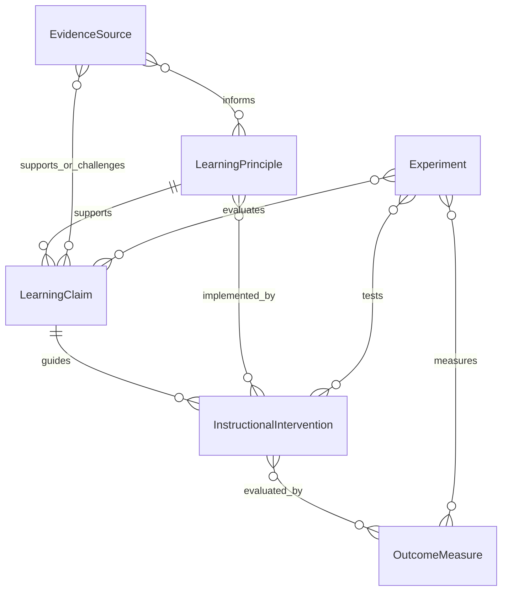

# Research-To-Product Domain Model

> **v1 scope note (second-review-pass):** For v1 (Phase 1 / Minimum Demo), the research-registry entities defined below — `LearningPrinciple`, `LearningClaim`, `EvidenceSource`, `InstructionalIntervention`, `OutcomeMeasure`, `Experiment` — live as **YAML files under `docs/research/`** with a build-time validator and reference linter. They are **not** runtime DB tables and not exposed as HTTP resources in Phase 1. The seed records and field tables in this document are the conceptual schema for the YAML files; they are not a v1 SQLAlchemy model spec. Runtime registry APIs (`/research/*`) are deferred indefinitely and would only be added if a product feature reads them at request time. See `docs/product/project-plan.md` "Data Model Priorities" and Milestone 2 for the current implementation posture.

This document defines the first-pass conceptual schema for turning learning science principles into an API-first LMS. It is intentionally implementation-neutral; later backend work can translate these entities into database tables, ORM models, API resources, or event schemas.

## Design Goals

- Preserve provenance from book notes, research sources, internal experiments, and project decisions.
- Separate learning claims from instructional activities and measured outcomes.
- Prevent analytics from implying causation when only correlation is available.
- Support personal learning, new analyst training, and company-wide project or technology training with the same core model.
- Make evidence status visible to course authors, trainers, managers, and learners where appropriate.

## Core Entities

### LearningPrinciple

A durable learning-science principle used to guide product and course design.

| Field | Type | Notes |
| --- | --- | --- |
| `id` | string | Stable identifier, e.g. `principle-causal-evidence`. |
| `name` | string | Human-readable principle name. |
| `summary` | text | Short paraphrase of the principle. |
| `mechanism` | text | Why the principle is expected to affect learning. |
| `sourceIds` | string[] | Links to `EvidenceSource` records. |
| `evidenceLevel` | enum | `established`, `promising`, `mixed`, `unsupported`, `deprecated`, `unknown`. |
| `confidence` | enum | `high`, `medium`, `low`. |
| `designImplications` | text[] | Product or course-design consequences. |
| `antiPatterns` | text[] | Practices this principle warns against. |
| `audiences` | enum[] | `personal`, `new-analyst`, `company-wide`. |
| `createdAt` / `updatedAt` | datetime | Audit fields. |

### EvidenceSource

A source that supports, limits, or challenges a learning claim.

| Field | Type | Notes |
| --- | --- | --- |
| `id` | string | Stable citation key, e.g. `nickerson-1998`. |
| `sourceType` | enum | `book`, `journal-article`, `book-chapter`, `review`, `meta-analysis`, `internal-experiment`, `personal-highlight`, `popular-highlight`, `project-decision`. |
| `citation` | text | Full bibliography entry. |
| `url` | string | DOI, publisher, PubMed, arXiv, or internal reference. |
| `sourceDate` | date | Publication or capture date. |
| `reliabilityNotes` | text | Peer review, replication, limitations, or provenance caveats. |
| `copyrightNotes` | text | Whether the repo stores only paraphrase, short quote, or internal notes. |
| `createdAt` / `updatedAt` | datetime | Audit fields. |

### LearningClaim

A specific claim derived from one or more principles or sources. This prevents the system from treating broad principles as operational facts without context.

| Field | Type | Notes |
| --- | --- | --- |
| `id` | string | Stable identifier. |
| `statement` | text | Example: "Completion is not sufficient evidence of learning." |
| `principleIds` | string[] | Related `LearningPrinciple` records. |
| `sourceIds` | string[] | Supporting or challenging sources. |
| `claimStatus` | enum | `established`, `promising`, `mixed`, `unsupported`, `deprecated`, `needs-review`. |
| `claimType` | enum | `descriptive`, `causal`, `design-rule`, `measurement-rule`, `risk-warning`. |
| `scope` | text | Learner type, domain, task type, and context where the claim applies. |
| `reviewCadence` | enum | `quarterly`, `semiannual`, `annual`, `on-new-evidence`. |
| `lastReviewedAt` | datetime | Evidence hygiene. |

### InstructionalIntervention

A designed learning action, content pattern, course feature, or product behavior.

| Field | Type | Notes |
| --- | --- | --- |
| `id` | string | Stable identifier. |
| `name` | string | Example: "low-stakes retrieval prompt." |
| `description` | text | What the learner or trainer experiences. |
| `interventionType` | enum | `retrieval`, `spacing`, `elaboration`, `worked-example`, `feedback`, `simulation`, `case`, `reflection`, `assessment`, `dashboard`, `recommendation`. |
| `principleIds` | string[] | Learning principles intentionally implemented. |
| `activeIngredients` | text[] | Mechanisms such as retrieval, explanation, comparison, feedback, or transfer. |
| `targetAudience` | enum[] | `personal`, `new-analyst`, `company-wide`. |
| `targetKnowledgeType` | enum[] | `factual`, `conceptual`, `procedural`, `judgment`, `metacognitive`. |
| `contextRequirements` | text[] | Conditions needed for likely effectiveness. |
| `riskNotes` | text[] | Known misuse risks or unsupported assumptions. |
| `sensitivityLevel` | enum | `public`, `internal`, `confidential`, `restricted-strategy`. |

### OutcomeMeasure

A measurable signal used to evaluate learning, behavior, or product performance.

| Field | Type | Notes |
| --- | --- | --- |
| `id` | string | Stable identifier. |
| `name` | string | Example: "delayed recall accuracy." |
| `measureType` | enum | `activity`, `engagement`, `confidence`, `knowledge`, `retention`, `transfer`, `job-performance`, `satisfaction`, `compliance`. |
| `description` | text | What is measured and how. |
| `instrument` | text | Quiz, rubric, manager review, work product, system event, survey, etc. |
| `validityNotes` | text | What the measure can and cannot support. |
| `collectionWindow` | text | Immediate, delayed, recurring, project-based, or event-triggered. |
| `sensitive` | boolean | Whether access must be restricted. |

### Experiment

A structured comparison used to evaluate an intervention or claim.

| Field | Type | Notes |
| --- | --- | --- |
| `id` | string | Stable identifier. |
| `name` | string | Experiment name. |
| `hypothesis` | text | What is expected to happen and why. |
| `claimIds` | string[] | Claims being tested. |
| `interventionIds` | string[] | Treatments being compared. |
| `outcomeMeasureIds` | string[] | Measures used for evaluation. |
| `designType` | enum | `descriptive`, `pre-post`, `controlled`, `randomized-controlled`, `quasi-experimental`, `observational`. |
| `comparisonGroups` | text[] | Control and treatment definitions. |
| `sampleDescription` | text | Learner population and context. |
| `analysisPlan` | text | Statistical and qualitative plan. |
| `effectSize` | string | Effect size result or planned metric. |
| `statisticalResult` | string | p-value, interval, or qualitative result summary. |
| `practicalSignificance` | text | Whether the result matters operationally. |
| `causalStrength` | enum | `none`, `correlational`, `suggestive`, `strong`, `replicated`. |
| `decision` | enum | `adopt`, `iterate`, `reject`, `needs-more-data`, `monitor`. |

## Relationships



## API Resource Sketch

```text
/learning-principles
/evidence-sources
/learning-claims
/instructional-interventions
/outcome-measures
/experiments
/experiments/{id}/results
/deprecated-claims
```

## Chapter 1 Seed Records

| Entity | Seed record |
| --- | --- |
| `LearningPrinciple` | `principle-evidence-informed-design`: learning decisions should be guided by evidence and context, not intuition alone. |
| `LearningPrinciple` | `principle-causal-evidence`: causal claims require stronger evidence than correlations. |
| `LearningPrinciple` | `principle-practical-significance`: effect size and operational value matter alongside statistical significance. |
| `LearningPrinciple` | `principle-visible-evidence-strength`: evidence status should be visible in product decisions. |
| `LearningClaim` | `claim-completion-not-learning`: lesson completion is activity evidence, not proof of durable learning. |
| `LearningClaim` | `claim-popularity-not-validity`: a method being widely used does not establish that it works. |
| `LearningClaim` | `claim-method-labels-insufficient`: method names must be decomposed into active learning ingredients. |
| `OutcomeMeasure` | `measure-delayed-retention`: learner can retrieve or apply the material after a delay. |
| `OutcomeMeasure` | `measure-transfer-work-product`: learner applies a principle in a realistic work product. |
| `Experiment` | `experiment-retrieval-vs-reread`: compare retrieval prompts against repeated exposure for a target concept. |

## Chapter 2 Seed Records

| Entity | Seed record |
| --- | --- |
| `LearningPrinciple` | `principle-memory-target-classification`: each learning objective should name the memory or performance system it targets. |
| `LearningPrinciple` | `principle-working-memory-load`: conscious learning must manage working-memory load. |
| `LearningPrinciple` | `principle-explicit-retrieval`: explicit knowledge must be retrievable into working memory before it counts as usable. |
| `LearningPrinciple` | `principle-procedural-practice`: procedural skill requires repeated practice and feedback. |
| `LearningPrinciple` | `principle-case-to-concept`: episodic case experience should be converted into semantic principles. |
| `LearningClaim` | `claim-passive-exposure-not-mastery`: unattended or passive exposure does not establish explicit learning. |
| `LearningClaim` | `claim-skill-not-single-exposure`: procedural skill cannot be validated by one content exposure. |
| `InstructionalIntervention` | `intervention-case-abstraction-prompt`: learner extracts reusable principles from a realistic case. |
| `InstructionalIntervention` | `intervention-progressive-skill-practice`: learner practices a procedure across gradually varied scenarios. |
| `OutcomeMeasure` | `measure-procedural-fluency`: learner performs a procedure accurately with reduced prompting over repeated attempts. |
| `OutcomeMeasure` | `measure-semantic-transfer`: learner applies a concept in a novel context, not only the original example. |

## Section 2.2 Seed Records

| Entity | Seed record |
| --- | --- |
| `LearningPrinciple` | `principle-knowledge-network`: learning objects should be modeled as connected knowledge rather than isolated content items. |
| `LearningPrinciple` | `principle-prior-knowledge-diagnostic`: the system should check whether learners have prerequisite knowledge before assigning complex work. |
| `LearningPrinciple` | `principle-prior-knowledge-activation`: instruction should mobilize relevant prior knowledge before introducing new material. |
| `LearningPrinciple` | `principle-active-learning-by-thinking`: activities are learning-relevant when they cause learners to think about the target idea. |
| `LearningPrinciple` | `principle-guided-construction`: learners construct knowledge, but product design should provide guidance, examples, prompts, and feedback. |
| `LearningClaim` | `claim-doing-is-not-active-learning`: visible activity is not sufficient if it does not require meaningful processing of the learning object. |
| `LearningClaim` | `claim-coverage-is-not-understanding`: broad exposure to many topics does not establish transferable understanding. |
| `InstructionalIntervention` | `intervention-prerequisite-check`: diagnostic prompt or task that checks readiness for a module. |
| `InstructionalIntervention` | `intervention-prior-knowledge-activation`: opening scenario or question that helps learners retrieve relevant existing knowledge. |
| `InstructionalIntervention` | `intervention-connection-prompt`: learner explains how a new idea relates to prior cases, analogies, exceptions, or current work. |
| `OutcomeMeasure` | `measure-visible-reasoning`: learner produces an observable explanation, comparison, prediction, classification, or decision rationale. |
| `OutcomeMeasure` | `measure-inert-knowledge-risk`: learner can apply the concept outside the original lesson format and context. |

## Section 2.3 Seed Records

| Entity | Seed record |
| --- | --- |
| `LearningPrinciple` | `principle-retrieval-as-learning`: retrieval practice is a learning event, not only an assessment event. |
| `LearningPrinciple` | `principle-retrieval-demand-levels`: familiarity, recognition, cued recall, free recall, explanation, and transfer place different demands on memory. |
| `LearningPrinciple` | `principle-calibrated-desirable-difficulty`: productive difficulty improves durable learning when the task remains achievable and feedback is available. |
| `LearningPrinciple` | `principle-spaced-interleaved-retrieval`: spaced and interleaved retrieval produce more durable learning than massed or blocked practice. |
| `LearningClaim` | `claim-rereading-fluency-not-mastery`: rereading can create familiarity without usable recall. |
| `LearningClaim` | `claim-arbitrary-memorization-not-general-memory`: unrelated memorization does not strengthen general memory capacity. |
| `InstructionalIntervention` | `intervention-low-stakes-retrieval`: frequent lightweight recall, explanation, or application prompt with feedback. |
| `InstructionalIntervention` | `intervention-spaced-review-scheduler`: review queue that spaces successful retrieval attempts and adapts after failures. |
| `InstructionalIntervention` | `intervention-interleaved-practice-set`: mixed practice set requiring learners to choose the appropriate concept, strategy, or procedure. |
| `OutcomeMeasure` | `measure-delayed-free-recall`: learner retrieves target knowledge after a delay without strong cue support. |
| `OutcomeMeasure` | `measure-transfer-retrieval`: learner uses target knowledge in a new context or realistic work product. |
| `OutcomeMeasure` | `measure-fluency-illusion-risk`: learner has high exposure or confidence but weak recall/application performance. |

## Section 2.4 Seed Records

| Entity | Seed record |
| --- | --- |
| `LearningPrinciple` | `principle-conceptual-reorganization`: some learning goals require restructuring prior knowledge rather than adding facts. |
| `LearningPrinciple` | `principle-misconception-models`: recurring wrong answers can reflect coherent prior models that need targeted revision. |
| `LearningPrinciple` | `principle-guided-model-revision`: conceptual change works better when learners predict, confront failure, and reconstruct their explanation with guidance. |
| `LearningPrinciple` | `principle-transitional-models`: intermediate hybrid models should be treated as meaningful learner states. |
| `LearningClaim` | `claim-correct-language-can-hide-old-model`: learners may repeat the right terms while preserving the original causal structure underneath. |
| `LearningClaim` | `claim-explanation-alone-insufficient`: direct explanation without model articulation and comparison often fails to change the learner's underlying conception. |
| `InstructionalIntervention` | `intervention-prediction-discrepant-case`: learner predicts an outcome, encounters counterevidence, and revises the model. |
| `InstructionalIntervention` | `intervention-model-contrast-feedback`: feedback explicitly compares the learner's prior model with the target model and names the failure point. |
| `InstructionalIntervention` | `intervention-self-explanation-repair`: learner explains why the original answer failed and why the revised explanation works. |
| `OutcomeMeasure` | `measure-misconception-pattern`: answer pattern indicating a specific prior model or misconception family. |
| `OutcomeMeasure` | `measure-model-revision-durability`: learner continues using the revised model across later cases and delays. |
| `OutcomeMeasure` | `measure-transitional-understanding`: learner shows partial restructuring or hybrid understanding rather than stable mastery. |

## Section 2.5 Seed Records

| Entity | Seed record |
| --- | --- |
| `LearningPrinciple` | `principle-transfer-is-explicit`: transfer should be treated as a named learning target rather than assumed from lesson completion. |
| `LearningPrinciple` | `principle-near-far-transfer`: similar-context transfer and distant-context transfer should be modeled and measured separately. |
| `LearningPrinciple` | `principle-multi-context-abstraction`: transfer improves when the same principle is encountered across varied contexts and explicitly abstracted. |
| `LearningPrinciple` | `principle-negative-transfer-risk`: prior learning can interfere with new performance when surface similarity hides a changed rule. |
| `LearningClaim` | `claim-context-bound-performance`: success in one representation or work format does not guarantee success in an equivalent new context. |
| `LearningClaim` | `claim-rote-limits-transfer`: procedural reproduction without understanding produces weak adaptation to novel cases. |
| `InstructionalIntervention` | `intervention-transfer-case-sequence`: sequence of varied cases that preserves deep structure while changing surface context. |
| `InstructionalIntervention` | `intervention-analogy-abstraction-prompt`: learner compares multiple cases and states the shared principle, boundaries, and transfer conditions. |
| `InstructionalIntervention` | `intervention-negative-transfer-check`: assessment item or simulation that tests whether a previously useful rule is being misapplied. |
| `OutcomeMeasure` | `measure-near-transfer`: learner applies knowledge in a similar but not identical task context. |
| `OutcomeMeasure` | `measure-far-transfer`: learner applies knowledge in a structurally related but superficially different context. |
| `OutcomeMeasure` | `measure-negative-transfer-error`: learner applies an old rule incorrectly in a new setting where it should be inhibited or revised. |

## Section 2.6 Seed Records

| Entity | Seed record |
| --- | --- |
| `LearningPrinciple` | `principle-working-memory-budget`: every learning activity should be designed with an explicit view of what the learner must hold and manipulate at once. |
| `LearningPrinciple` | `principle-extraneous-load-elimination`: unnecessary cognitive load should be treated as a removable design defect. |
| `LearningPrinciple` | `principle-progressive-complexity`: intrinsic load should be managed through chunking, sequencing, and staged integration. |
| `LearningPrinciple` | `principle-protect-germane-load`: product design should remove needless burden while preserving meaningful processing. |
| `LearningPrinciple` | `principle-dual-channel-design`: visual and verbal channels should be used strategically without redundant overload. |
| `LearningClaim` | `claim-overload-masquerades-as-inattention`: losing place, forgetting steps, and task abandonment can reflect cognitive overload rather than low motivation. |
| `LearningClaim` | `claim-domain-knowledge-reduces-effective-load`: meaningful knowledge lowers working-memory burden within the relevant domain. |
| `InstructionalIntervention` | `intervention-stepwise-task-flow`: guided task flow that reveals information progressively and marks current step position. |
| `InstructionalIntervention` | `intervention-overload-recovery-path`: narrowed retry path with hints, checkpoints, or external supports after likely overload. |
| `InstructionalIntervention` | `intervention-authoring-load-check`: authoring rule set or lint pass that flags redundancy, long instructions, and high simultaneous element counts. |
| `OutcomeMeasure` | `measure-overload-risk-signal`: event pattern such as repeated restart, step loss, backtracking, or abandonment during complex tasks. |
| `OutcomeMeasure` | `measure-load-adjusted-completion`: learner completes a task successfully after supports reduce extraneous or intrinsic load. |
| `OutcomeMeasure` | `measure-support-dependence`: learner still requires checklists, worked examples, or step prompts to complete a task accurately. |

## Section 2.7 Seed Records

| Entity | Seed record |
| --- | --- |
| `LearningPrinciple` | `principle-deep-knowledge-enables-expertise`: expert performance depends on broad, meaningful, well-organized knowledge. |
| `LearningPrinciple` | `principle-knowledge-precedes-higher-order-performance`: critical thinking, problem solving, and creativity depend on domain knowledge rather than replacing it. |
| `LearningPrinciple` | `principle-deliberate-practice`: purposeful, feedback-rich, progressively difficult practice develops skill better than repetition alone. |
| `LearningPrinciple` | `principle-decompose-integrate`: complex learning objects can often be taught through component mastery followed by reintegration. |
| `LearningPrinciple` | `principle-automaticity-targeting`: selected foundational skills should become automatic so working memory can focus on harder tasks. |
| `LearningClaim` | `claim-experts-see-patterns`: experts perceive and classify situations through meaningful chunks and underlying principles. |
| `LearningClaim` | `claim-novices-follow-surface-features`: novices are more likely to classify and act on superficial cues rather than deep structure. |
| `LearningClaim` | `claim-component-practice-needs-purpose`: isolated subskill practice can damage motivation unless learners see its relevance and later integration. |
| `InstructionalIntervention` | `intervention-principle-based-case-index`: case bank and prompt design organized by governing principle instead of surface category alone. |
| `InstructionalIntervention` | `intervention-part-task-sequence`: decomposed skill sequence with explicit reintegration checkpoints. |
| `InstructionalIntervention` | `intervention-fluency-target-track`: repeated practice track for foundational skills that should reach automaticity. |
| `OutcomeMeasure` | `measure-principle-classification`: learner groups problems or cases by underlying principle rather than by superficial similarity. |
| `OutcomeMeasure` | `measure-integrated-performance`: learner successfully recombines previously isolated component skills in an authentic task. |
| `OutcomeMeasure` | `measure-automaticity-readiness`: learner performs a foundational routine accurately with low apparent working-memory demand. |

## Section 3.1 Seed Records

| Entity | Seed record |
| --- | --- |
| `LearningPrinciple` | `principle-emotion-mechanism-clarity`: motivation, emotional education, emotional arousal, and emotional memory effects should be modeled as distinct mechanisms. |
| `LearningPrinciple` | `principle-attention-safe-emotion-design`: emotionally salient design should protect attention and avoid unnecessary threat. |
| `LearningPrinciple` | `principle-feelings-are-self-reports`: reported feelings are interpreted descriptions, not direct measurements of underlying emotion. |
| `LearningClaim` | `claim-fear-diverts-attention`: fear of error or humiliation can consume attention and reduce learning performance. |
| `LearningClaim` | `claim-emotion-not-always-beneficial`: stronger emotional experience does not automatically improve learning or memory. |
| `InstructionalIntervention` | `intervention-calm-error-state`: feedback and failure states designed to reduce threat while preserving clarity and actionability. |
| `InstructionalIntervention` | `intervention-emotion-reflection-prompt`: learner describes and interprets emotional state using flexible prompts rather than rigid labels. |
| `InstructionalIntervention` | `intervention-high-intensity-review-gate`: approval step requiring rationale and recovery path before deploying emotionally intense simulations or assessments. |
| `OutcomeMeasure` | `measure-threat-attention-risk`: learner behavior indicating attention diversion around evaluative or socially threatening moments. |
| `OutcomeMeasure` | `measure-self-reported-affect-pattern`: reflective learner reports about emotional state over time, interpreted cautiously. |

## Section 3.2 Seed Records

| Entity | Seed record |
| --- | --- |
| `LearningPrinciple` | `principle-goal-directed-motivation`: motivation should be modeled as goal-directed effort toward a defined learning object or competency. |
| `LearningPrinciple` | `principle-mastery-over-performance-signaling`: product design should favor learning-goal orientation over status-oriented performance signaling. |
| `LearningPrinciple` | `principle-value-and-expectations`: motivation can be increased mainly by acting on subjective value and expectations of success. |
| `LearningPrinciple` | `principle-interest-not-ornament`: interest should come from the learning object or its meaningful context rather than decorative fun. |
| `LearningPrinciple` | `principle-domain-specific-self-efficacy`: expectations of success should be measured and supported at the task, skill, or domain level. |
| `LearningClaim` | `claim-shallow-assessment-rewards-shallow-goals`: tests that reward memorization and short-term preparation can strengthen performance goals without producing durable learning. |
| `LearningClaim` | `claim-early-success-reinforces-motivation`: visible progress and early success strengthen self-efficacy and later persistence. |
| `LearningClaim` | `claim-utility-can-bootstrap-interest`: extrinsic utility and authentic relevance can legitimately initiate engagement before intrinsic interest develops. |
| `InstructionalIntervention` | `intervention-utility-framing-card`: explicit explanation of why a lesson matters for work, decisions, or downstream capability. |
| `InstructionalIntervention` | `intervention-progressive-milestone-sequence`: complex learning task broken into milestones that create early success opportunities. |
| `InstructionalIntervention` | `intervention-confidence-skill-check`: learner reports expected success on a specific task or skill before and after practice. |
| `InstructionalIntervention` | `intervention-assessment-alignment-check`: authoring or review rule ensuring that practice, feedback, and assessment target the same depth of learning. |
| `OutcomeMeasure` | `measure-goal-orientation-pattern`: evidence that learner behavior reflects mastery, performance-approach, or performance-avoidance patterns. |
| `OutcomeMeasure` | `measure-task-self-efficacy`: learner confidence rating attached to a specific concept, task, or competency. |
| `OutcomeMeasure` | `measure-interest-conversion`: learner moves from situational engagement toward repeated voluntary engagement with the topic. |
| `OutcomeMeasure` | `measure-assessment-depth-alignment`: degree to which course assessments reflect intended understanding, transfer, and performance outcomes. |

## Section 3.3 Seed Records

| Entity | Seed record |
| --- | --- |
| `LearningPrinciple` | `principle-beliefs-shape-motivation`: beliefs about learning and ability shape the values and expectations that drive motivated action. |
| `LearningPrinciple` | `principle-attribution-design`: feedback and reflection should support controllable, revisable explanations of success and failure. |
| `LearningPrinciple` | `principle-strategy-plus-belief`: effort-oriented or mindset-oriented interventions should be paired with effective strategies and real success opportunities. |
| `LearningPrinciple` | `principle-no-fixed-labels`: learner models and UX should avoid fixed ability labels, including flattering ones. |
| `LearningPrinciple` | `principle-stereotype-safe-learning`: systems should be designed to avoid reinforcing identity-linked competence stereotypes. |
| `LearningClaim` | `claim-score-alone-insufficient`: outcome data without interpretation support can leave learners with harmful causal explanations. |
| `LearningClaim` | `claim-help-seeking-is-belief-sensitive`: willingness to ask for help depends partly on whether help-seeking is interpreted as weakness or as effective learning behavior. |
| `LearningClaim` | `claim-mindset-effects-bounded`: growth-mindset interventions may help under some conditions, but effects can be modest, heterogeneous, or difficult to scale. |
| `InstructionalIntervention` | `intervention-attribution-reframe`: post-result prompt that helps learners connect outcomes to strategies, preparation, and next actions. |
| `InstructionalIntervention` | `intervention-belief-plus-strategy-sequence`: short belief-support message coupled with worked examples, study methods, or practice plans. |
| `InstructionalIntervention` | `intervention-help-seeking-normalizer`: UI and copy that frame hints, examples, coaching, and retries as skilled learning behavior. |
| `InstructionalIntervention` | `intervention-stereotype-risk-review`: content and analytics review pass that checks for identity-linked competence signaling or biased comparisons. |
| `OutcomeMeasure` | `measure-attribution-pattern`: learner explanation trend after success or failure, especially fixed versus controllable causes. |
| `OutcomeMeasure` | `measure-help-seeking-safety`: rate and timing of hint use, question asking, or coaching requests in difficult tasks without shame-like avoidance patterns. |
| `OutcomeMeasure` | `measure-belief-shift-durability`: whether productive belief changes persist across later tasks and delays. |
| `OutcomeMeasure` | `measure-label-risk`: evidence that badges, rankings, or identity-like descriptors are changing risk-taking, help-seeking, or avoidance in undesirable ways. |

## Section 3.4 Seed Records

| Entity | Seed record |
| --- | --- |
| `LearningPrinciple` | `principle-social-support-matters`: learner motivation and participation depend partly on perceived support from teachers, mentors, and peers. |
| `LearningPrinciple` | `principle-dialogue-driven-social-learning`: social learning works through explanation, critique, comparison, and clarification rather than mere co-presence. |
| `LearningPrinciple` | `principle-zpd-scaffolding`: support should target what learners can do with guidance but not yet independently. |
| `LearningPrinciple` | `principle-cooperative-structure`: cooperative learning needs structured interdependence, heterogeneity, and individual accountability. |
| `LearningPrinciple` | `principle-social-threat-guardrail`: stereotype activation and expectancy bias can distort performance and learning in evaluative situations. |
| `LearningClaim` | `claim-groupwork-not-cooperation`: many group tasks fail educationally because they produce shared output without shared learning. |
| `LearningClaim` | `claim-expectancy-effects-bounded`: teacher or evaluator expectancy effects are real but often modest and context-dependent. |
| `LearningClaim` | `claim-diversity-can-aid-learning`: heterogeneous groups can improve learning for all when collaboration is structured effectively. |
| `InstructionalIntervention` | `intervention-structured-peer-dialogue`: collaborative activity that requires each learner to explain, question, and reconcile ideas explicitly. |
| `InstructionalIntervention` | `intervention-peer-scaffold-match`: mentor or peer assignment based on current independent performance and desired supported performance. |
| `InstructionalIntervention` | `intervention-cooperation-protocol`: explicit prompts or rules for communication, turn-taking, conflict resolution, and shared accountability. |
| `InstructionalIntervention` | `intervention-social-threat-review`: content, assessment, and reporting review that checks for stereotype cues, evaluator bias, and coercive support signaling. |
| `OutcomeMeasure` | `measure-dialogue-quality`: evidence that learners are explaining, questioning, and revising rather than merely posting or agreeing. |
| `OutcomeMeasure` | `measure-individual-learning-in-group-task`: learner-level evidence of understanding after a shared collaborative activity. |
| `OutcomeMeasure` | `measure-support-perception`: learner report or behavior signal indicating whether guidance feels supportive, pressuring, or absent. |
| `OutcomeMeasure` | `measure-collaboration-equity`: distribution of contribution, explanation burden, and learning gain across group members. |

## Section 4.1 Seed Records

| Entity | Seed record |
| --- | --- |
| `LearningPrinciple` | `principle-metacognitive-control`: learners improve when they can plan, monitor, evaluate, and adjust their own learning processes. |
| `LearningPrinciple` | `principle-calibration-evidence`: learner confidence should be compared against retrieval and performance evidence rather than trusted by itself. |
| `LearningPrinciple` | `principle-planning-before-performance`: complex tasks should include explicit planning before execution. |
| `LearningPrinciple` | `principle-strategy-selection`: learners need support choosing strategies that fit the task and learning goal. |
| `LearningPrinciple` | `principle-faded-self-regulation-scaffold`: metacognitive support should fade as learners demonstrate autonomous control. |
| `LearningClaim` | `claim-familiarity-not-mastery`: rereading and familiarity can create illusions of knowing without reliable retrieval or transfer. |
| `LearningClaim` | `claim-novices-underplan`: novices often start tasks procedurally before fully representing the goal, criteria, and constraints. |
| `LearningClaim` | `claim-better-strategies-feel-costly`: learners may avoid effective strategies because they feel harder or slower at first. |
| `InstructionalIntervention` | `intervention-task-goal-clarifier`: task screen that states the objective, success criteria, expected thinking, and common misreadings. |
| `InstructionalIntervention` | `intervention-plan-before-work`: required planning artifact before a case, project, memo, or complex assessment. |
| `InstructionalIntervention` | `intervention-calibrated-self-test`: confidence prompt paired with retrieval or performance evidence. |
| `InstructionalIntervention` | `intervention-strategy-recommendation`: task-specific strategy recommendation with rationale and follow-up check. |
| `InstructionalIntervention` | `intervention-reflection-to-revision`: reflection prompt that must update a plan, schedule, strategy, or support request. |
| `OutcomeMeasure` | `measure-confidence-performance-gap`: difference between expected and demonstrated performance. |
| `OutcomeMeasure` | `measure-planning-quality`: completeness and relevance of learner planning before complex work. |
| `OutcomeMeasure` | `measure-strategy-fit`: whether learner-selected strategies match the learning goal and evidence of need. |
| `OutcomeMeasure` | `measure-autonomy-readiness`: evidence that the learner can plan, monitor, and adjust with reduced scaffolding. |

## Section 4.2 Seed Records

| Entity | Seed record |
| --- | --- |
| `LearningPrinciple` | `principle-self-control-support`: self-control should be treated as a supportable learning capacity involving inhibition, attention, and delayed gratification. |
| `LearningPrinciple` | `principle-distraction-control-cost`: avoidable distraction consumes limited inhibitory-control resources that should be reserved for learning. |
| `LearningPrinciple` | `principle-autonomy-with-structure`: regulation develops best when meaningful choice is paired with clear expectations and consistent boundaries. |
| `LearningPrinciple` | `principle-targeted-regulation-scaffold`: self-control scaffolds should intensify when learners show regulation need and fade when behavior stabilizes. |
| `LearningPrinciple` | `principle-direct-inhibition-practice`: inhibition should be practiced through explicit routines or activities, not by degrading the learning environment. |
| `LearningClaim` | `claim-self-control-academic-link`: self-control is associated with academic achievement and broader adjustment, though causal interpretation requires caution. |
| `LearningClaim` | `claim-control-is-limited`: sustained inhibition can fatigue and reduce later planning, decision-making, and problem-solving quality. |
| `LearningClaim` | `claim-clutter-noise-hurt-attention`: visual clutter and noise can impair attention and learning, especially for younger learners. |
| `InstructionalIntervention` | `intervention-focus-session-shell`: focused task mode that hides nonessential navigation, notifications, and competing prompts during deliberate practice. |
| `InstructionalIntervention` | `intervention-delayed-reward-milestone`: progress display that makes long-term learning payoff visible through near milestones and future-use framing. |
| `InstructionalIntervention` | `intervention-regulation-sprint`: short routine that asks learners to set a goal, prepare the environment, work for a fixed interval, and reflect on control demands. |
| `InstructionalIntervention` | `intervention-autonomy-structured-choice`: learner choice among routes, examples, or practice modes within explicit success criteria and deadlines. |
| `OutcomeMeasure` | `measure-sustained-attention`: evidence that a learner can remain engaged with a focused task without repeated interruption or abandonment. |
| `OutcomeMeasure` | `measure-regulation-recovery-need`: signal that a learner needs a break, smaller task segment, or reduced control demand before further difficult reasoning. |
| `OutcomeMeasure` | `measure-distraction-friction`: count or classification of avoidable interruptions, clutter, or unnecessary choices in a learning flow. |
| `OutcomeMeasure` | `measure-delayed-gratification-behavior`: learner behavior showing completion of planned learning actions before optional rewards or diversions. |

## Section 4.3 Seed Records

| Entity | Seed record |
| --- | --- |
| `LearningPrinciple` | `principle-emotion-learning-readiness`: emotional state affects attention, working memory, motivation, and performance during learning. |
| `LearningPrinciple` | `principle-performance-emotion-design`: exams, grades, and feedback should be designed as emotionally consequential moments. |
| `LearningPrinciple` | `principle-reappraisal-before-suppression`: cognitive reappraisal should be preferred over suppression or post-hoc venting as a learning support. |
| `LearningPrinciple` | `principle-supportive-demand`: emotionally supportive learning environments can remain demanding when expectations, rules, and help are clear. |
| `LearningPrinciple` | `principle-executive-emotion-link`: emotional regulation depends on executive functions and should be integrated with self-regulation scaffolds. |
| `LearningClaim` | `claim-emotion-captures-cognition`: strong emotions can capture attention and reduce working-memory resources available for learning. |
| `LearningClaim` | `claim-value-expectancy-emotion`: academic emotions often arise from appraisals of task value, expected success, control, and personal meaning. |
| `LearningClaim` | `claim-venting-can-backfire`: cathartic venting or aggressive release may sustain anger or create social costs rather than improving regulation. |
| `InstructionalIntervention` | `intervention-pre-assessment-reappraisal`: pre-assessment routine that asks learners to identify value, expected challenge, controllable actions, and a regulation plan. |
| `InstructionalIntervention` | `intervention-feedback-reappraisal-frame`: feedback pattern that interprets errors as evidence for strategy adjustment, not fixed inability. |
| `InstructionalIntervention` | `intervention-breathing-reset`: brief controlled-breathing routine offered before or during stressful learning moments. |
| `InstructionalIntervention` | `intervention-emotional-support-escalation`: handoff path for severe anxiety or stress that requires human or specialist support. |
| `OutcomeMeasure` | `measure-emotional-readiness`: learner self-report or behavioral signal indicating readiness for a demanding task. |
| `OutcomeMeasure` | `measure-feedback-recovery`: whether learners return to productive action after receiving corrective feedback. |
| `OutcomeMeasure` | `measure-reappraisal-use`: evidence that the learner reframed difficulty, error, or threat in a controllable way. |
| `OutcomeMeasure` | `measure-assessment-avoidance`: repeated postponement, abandonment, or self-sabotage around high-stakes tasks. |

## Section 4.4 Seed Records

| Entity | Seed record |
| --- | --- |
| `LearningPrinciple` | `principle-resilience-recovery-behavior`: resilience should be modeled as observable recovery, re-engagement, and revision after setback. |
| `LearningPrinciple` | `principle-persistence-strategy-change`: productive persistence requires diagnosis and strategy adjustment, not only repeated effort. |
| `LearningPrinciple` | `principle-long-goal-action-bridge`: long-term goals should be translated into near-term actions and progress evidence. |
| `LearningPrinciple` | `principle-belief-success-loop`: growth-oriented beliefs become credible when learners experience effort and strategy producing success. |
| `LearningPrinciple` | `principle-supported-productive-struggle`: resilience develops through supported difficulty rather than overprotection or unsupported failure. |
| `LearningClaim` | `claim-grit-predictive-limits`: grit may predict some outcomes, but it overlaps with other constructs and should not be treated as a complete explanation. |
| `LearningClaim` | `claim-context-matters-for-persistence`: persistence and abandonment must be interpreted in light of opportunity, task design, support, and environment. |
| `LearningClaim` | `claim-effort-without-adaptation-can-fail`: repeated effort without changing an ineffective method may prolong failure rather than build resilience. |
| `InstructionalIntervention` | `intervention-failure-recovery-loop`: post-failure workflow requiring feedback review, cause attribution, strategy change, and a revised attempt. |
| `InstructionalIntervention` | `intervention-long-goal-breakdown`: tool that decomposes distant goals into milestones, weekly actions, and evidence checks. |
| `InstructionalIntervention` | `intervention-improvement-trace`: learner-facing history showing how strategy changes, effort, and feedback produced improvement over time. |
| `InstructionalIntervention` | `intervention-productive-struggle-scaffold`: challenging task design with hints, checkpoints, examples, and retry paths. |
| `OutcomeMeasure` | `measure-setback-reengagement`: whether and how quickly a learner returns to work after failure or difficult feedback. |
| `OutcomeMeasure` | `measure-strategy-revision-after-failure`: evidence that the learner changed method after diagnosing an error. |
| `OutcomeMeasure` | `measure-effort-success-link`: learner-visible evidence that revised effort led to improved performance. |
| `OutcomeMeasure` | `measure-supported-challenge-fit`: whether task difficulty is high enough to require effort but still achievable with available support. |

## Section 5 Introduction Seed Records

| Entity | Seed record |
| --- | --- |
| `LearningPrinciple` | `principle-teaching-through-learner-activity`: teaching improves learning by shaping what learners do and think. |
| `LearningPrinciple` | `principle-core-teaching-processes`: instruction, feedback, and assessment should be modeled as distinct but connected teaching processes. |
| `LearningPrinciple` | `principle-feedback-as-guidance`: feedback should guide improvement rather than only report status or correctness. |
| `LearningClaim` | `claim-exposure-not-learning`: content exposure or time-on-task is not sufficient evidence that learning occurred. |
| `LearningClaim` | `claim-teacher-effectiveness-varies`: teaching effectiveness varies in ways not explained by experience alone. |
| `InstructionalIntervention` | `intervention-learner-action-declaration`: each learning object declares the learner action and cognitive process it is intended to produce. |
| `InstructionalIntervention` | `intervention-process-linked-lesson`: lesson design that links instruction, feedback, and assessment records for the same learning objective. |
| `OutcomeMeasure` | `measure-intended-learner-action`: whether the learner performed the cognitive action the instruction was designed to elicit. |
| `OutcomeMeasure` | `measure-feedback-uptake`: whether learners use feedback to revise work or improve later performance. |

## Section 5.1 Seed Records

| Entity | Seed record |
| --- | --- |
| `LearningPrinciple` | `principle-method-goal-fit`: instructional methods should be selected according to learning goal, learner readiness, context, and evidence rather than method label. |
| `LearningPrinciple` | `principle-guidance-novice-secondary-knowledge`: novices learning academic or professional knowledge need explicit guidance, examples, and structured practice. |
| `LearningPrinciple` | `principle-sequenced-cognitive-scaffold`: instruction should sequence and dose new material to manage working-memory load while building toward integrated performance. |
| `LearningPrinciple` | `principle-worked-example-fading`: worked examples should support novice learning and fade toward partial completion and independent problem solving. |
| `LearningPrinciple` | `principle-questioning-for-explanation`: instructional questions should elicit explanation, comparison, justification, connection, and application. |
| `LearningClaim` | `claim-no-universal-best-method`: teaching-method labels do not determine effectiveness without the learning mechanism and context. |
| `LearningClaim` | `claim-minimal-guidance-novice-risk`: unguided discovery can overload novices when learning culturally accumulated academic or professional knowledge. |
| `LearningClaim` | `claim-expertise-reversal`: guidance that benefits novices can become inefficient or counterproductive as learners gain expertise. |
| `InstructionalIntervention` | `intervention-guided-lesson-shell`: lesson template that combines objective, prior-knowledge activation, explanation, modeling, questions, practice, and feedback hooks. |
| `InstructionalIntervention` | `intervention-worked-example-ladder`: staged sequence from annotated worked example to partial completion to independent task. |
| `InstructionalIntervention` | `intervention-explanation-question-bank`: prompt set tagged by explain, compare, justify, connect, diagnose, apply, and transfer. |
| `InstructionalIntervention` | `intervention-component-to-integrated-practice`: practice plan that isolates prerequisite components before recombining them in authentic performance. |
| `OutcomeMeasure` | `measure-guidance-fit`: evidence that activity support level matches the learner's current competence and task complexity. |
| `OutcomeMeasure` | `measure-example-to-transfer-success`: whether learners can move from studying examples to completing novel tasks independently. |
| `OutcomeMeasure` | `measure-question-explanation-quality`: quality of learner explanations elicited by instructional questions. |
| `OutcomeMeasure` | `measure-practice-feedback-loop`: whether structured practice produces feedback use and later performance improvement. |

## Section 5.2 Seed Records

| Entity | Seed record |
| --- | --- |
| `LearningPrinciple` | `principle-feedback-goal-gap-next-action`: feedback should connect the learning goal, current performance evidence, and the next action for improvement. |
| `LearningPrinciple` | `principle-feedback-level-fit`: outcome, process, metacognitive, and learner-quality feedback have different learning and motivational consequences. |
| `LearningPrinciple` | `principle-feedback-timing-fit`: feedback timing should match whether the target is correctness, process, or metacognitive regulation. |
| `LearningPrinciple` | `principle-faded-feedback-support`: feedback should gradually shift from external guidance toward learner self-monitoring. |
| `LearningPrinciple` | `principle-grades-formative-risk`: grades can crowd out formative feedback by shifting attention to reputation, ranking, and fixed ability judgments. |
| `LearningClaim` | `claim-feedback-can-harm`: feedback can reduce performance or motivation when it is vague, poorly timed, trait-focused, or interpreted as ability judgment. |
| `LearningClaim` | `claim-process-feedback-transfers`: process and metacognitive feedback are more transferable than simple outcome feedback. |
| `LearningClaim` | `claim-comments-with-grades-ignored`: learners may ignore descriptive comments when grades are delivered at the same time. |
| `InstructionalIntervention` | `intervention-feedback-object-schema`: structured feedback record with goal, evidence, gap, feedback level, timing, next action, and revision opportunity. |
| `InstructionalIntervention` | `intervention-scaffolded-hint-feedback`: feedback sequence that starts with hints and escalates to explanation or re-teaching only when needed. |
| `InstructionalIntervention` | `intervention-comment-before-score`: assessment workflow that delivers formative comments before or separately from grades. |
| `InstructionalIntervention` | `intervention-revision-after-feedback`: required opportunity to apply feedback and resubmit or retry before final judgment. |
| `OutcomeMeasure` | `measure-feedback-next-action-use`: whether learners use feedback to revise work or improve the next attempt. |
| `OutcomeMeasure` | `measure-feedback-level-distribution`: proportion of feedback records focused on outcome, process, metacognition, or learner qualities. |
| `OutcomeMeasure` | `measure-score-comment-attention`: whether scores reduce learner attention to descriptive comments. |
| `OutcomeMeasure` | `measure-feedback-dependence`: whether learners continue needing frequent external feedback after practice. |

## Section 5.3 Seed Records

| Entity | Seed record |
| --- | --- |
| `LearningPrinciple` | `principle-assessment-claim-alignment`: assessments should measure the objective and performance claim they are used to support. |
| `LearningPrinciple` | `principle-score-measurement-context`: assessment scores require validity scope, reliability, accuracy, precision, and uncertainty context. |
| `LearningPrinciple` | `principle-transfer-assessment`: transfer claims require tasks that ask learners to use knowledge in new contexts. |
| `LearningPrinciple` | `principle-formative-evidence-action`: assessment is formative only when evidence is interpreted and used to improve learning or instruction. |
| `LearningPrinciple` | `principle-assessment-as-retrieval`: assessment can consolidate learning by requiring retrieval and reconstruction. |
| `LearningClaim` | `claim-grade-not-mastery`: grades summarize sampled performance and do not by themselves prove durable mastery. |
| `LearningClaim` | `claim-short-performance-not-learning`: same-session performance can overstate long-term learning. |
| `LearningClaim` | `claim-formative-assessment-variable`: formative assessment effects depend on implementation quality, feedback quality, and evidence use. |
| `InstructionalIntervention` | `intervention-assessment-evidence-schema`: assessment item schema declaring objective, evidence type, performance claim, validity scope, and feedback hooks. |
| `InstructionalIntervention` | `intervention-transfer-case-assessment`: case or scenario assessment designed to test application in a new context. |
| `InstructionalIntervention` | `intervention-formative-decision-loop`: workflow that turns assessment evidence into feedback, revision, reteaching, scheduling, or curriculum change. |
| `InstructionalIntervention` | `intervention-low-stakes-retrieval-assessment`: recurring quiz or recall task used both to measure and strengthen learning. |
| `OutcomeMeasure` | `measure-assessment-validity-fit`: degree of alignment between assessment task and intended learning claim. |
| `OutcomeMeasure` | `measure-retention-after-assessment`: later performance after an assessment-based retrieval event. |
| `OutcomeMeasure` | `measure-transfer-performance`: success on novel tasks after instruction and practice. |
| `OutcomeMeasure` | `measure-formative-action-taken`: whether assessment evidence led to a concrete instructional or learner action. |

## Appendix Seed Records

| Entity | Seed record |
| --- | --- |
| `LearningPrinciple` | `principle-neuromyth-skepticism`: plausible brain-based or science-branded claims need explicit evidence before product adoption. |
| `LearningPrinciple` | `principle-no-fixed-style-labels`: learner differences should not be operationalized as fixed visual, auditory, or kinesthetic learning-style paths. |
| `LearningPrinciple` | `principle-modality-task-fit`: instructional modality should be selected by content structure, accessibility, cognitive load, and task demands. |
| `LearningPrinciple` | `principle-plasticity-not-window-panic`: sensitive periods and early deprivation risks should not be translated into fatalistic claims about later learning. |
| `LearningPrinciple` | `principle-no-hemisphere-learner-types`: lateralization does not justify left-brain/right-brain learner profiles or hemisphere-based personalization. |
| `LearningClaim` | `claim-learning-styles-unsupported`: matching instruction to fixed sensory learning styles lacks adequate evidence. |
| `LearningClaim` | `claim-brain-potential-myth`: hidden-potential claims such as using only a small fraction of the brain should be treated as deprecated. |
| `LearningClaim` | `claim-more-brain-not-better-learning`: more synapses, stimulation, or activation does not automatically mean better learning. |
| `InstructionalIntervention` | `intervention-claim-evidence-gate`: authoring and product-review workflow that blocks unsupported neuroscience or personalization claims. |
| `InstructionalIntervention` | `intervention-task-modality-selector`: design helper that recommends media format from the learning object and task rather than a learner-style label. |
| `InstructionalIntervention` | `intervention-deprecated-claim-lint`: content check that flags learning styles, hemisphere-type, hidden-potential, and panic-window language. |
| `OutcomeMeasure` | `measure-unsupported-claim-count`: number and severity of unsupported claims detected in content, recommendations, or training materials. |
| `OutcomeMeasure` | `measure-task-modality-fit`: review score for whether chosen media helps learners understand the target idea. |
| `OutcomeMeasure` | `measure-evidence-gate-resolution`: whether flagged science claims are resolved with evidence, rewritten, or removed. |

## Math Academy Way Seed Records

| Entity | Seed record |
| --- | --- |
| `LearningPrinciple` | `principle-knowledge-graph-prerequisites`: graph-structured domains should represent prerequisites, key prerequisites, and dependency edges explicitly. |
| `LearningPrinciple` | `principle-mastery-confidence`: mastery should be stored as an evidence-backed estimate with confidence, recency, and source. |
| `LearningPrinciple` | `principle-adaptive-practice-scheduler`: retrieval, spacing, interleaving, remediation, and new instruction should be scheduled from learner state. |
| `LearningPrinciple` | `principle-implicit-review-credit`: advanced tasks can partially refresh earlier knowledge when graph relationships support the inference. |
| `LearningPrinciple` | `principle-automaticity-gateway`: some low-level skills require fluency before higher-order tasks can be performed efficiently. |
| `LearningPrinciple` | `principle-bounded-autonomy`: learner choice should occur within evidence-compatible task options. |
| `LearningClaim` | `claim-math-academy-acceleration-needs-review`: Math Academy's acceleration claims require separate evidence review before product use. |
| `LearningClaim` | `claim-xp-effort-proxy-needs-review`: XP-like metrics can support accountability but are imperfect effort and learning proxies. |
| `LearningClaim` | `claim-diagnostic-inference-provisional`: diagnostic placement should distinguish observed mastery from inferred or provisional mastery. |
| `InstructionalIntervention` | `intervention-knowledge-graph-authoring`: authoring workflow for tagging nodes, prerequisites, key prerequisites, encompassing edges, and interference risks. |
| `InstructionalIntervention` | `intervention-frontier-diagnostic`: adaptive diagnostic that estimates the learner's knowledge frontier with confidence scores. |
| `InstructionalIntervention` | `intervention-mixed-review-scheduler`: scheduler that assigns spaced and interleaved retrieval tasks based on due reviews and implicit review opportunities. |
| `InstructionalIntervention` | `intervention-component-remediation`: remediation task targeted to the component skill or prerequisite causing failure. |
| `InstructionalIntervention` | `intervention-retrieval-before-reference`: task flow that asks learners to retrieve before opening reference material. |
| `OutcomeMeasure` | `measure-mastery-estimate-confidence`: confidence level and evidence source for a learner's mastery estimate. |
| `OutcomeMeasure` | `measure-implicit-review-validity`: whether implicit review credit predicts later successful retrieval. |
| `OutcomeMeasure` | `measure-automaticity-fluency`: speed, accuracy, and reduced prompting on low-level prerequisite skills. |
| `OutcomeMeasure` | `measure-scheduler-choice-quality`: whether assigned tasks improve retention, transfer, or remediation relative to alternatives. |
| `OutcomeMeasure` | `measure-incentive-gaming-risk`: evidence that learners optimize a progress metric without corresponding learning gains. |

## Implementation Notes

- Keep proprietary investment examples in `restricted-strategy` records by default.
- Do not let `engagement` or `satisfaction` measures automatically satisfy `knowledge`, `retention`, or `transfer` requirements.
- Require a `claimStatus` before a claim can drive personalization, manager reporting, or required training policy.
- Prefer additive evidence history over destructive edits: preserve prior status and record why it changed.
